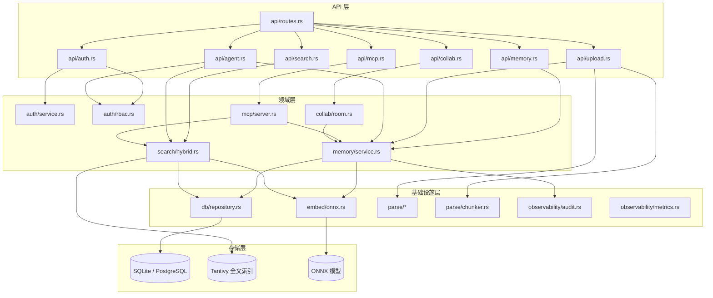
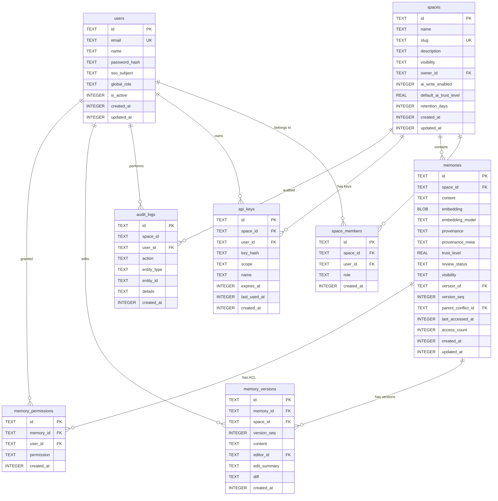
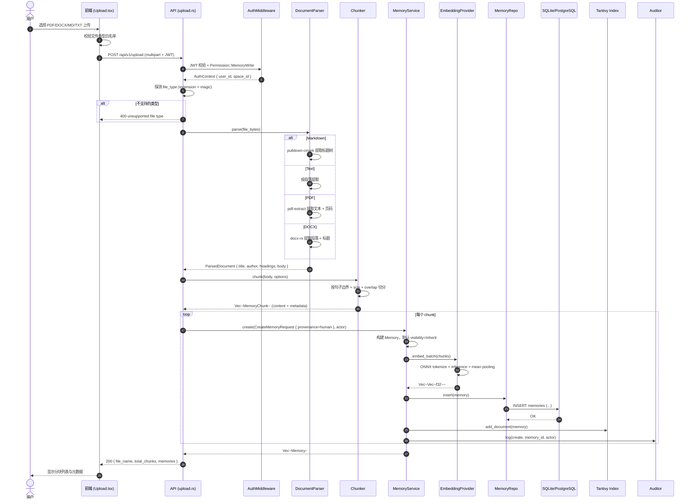
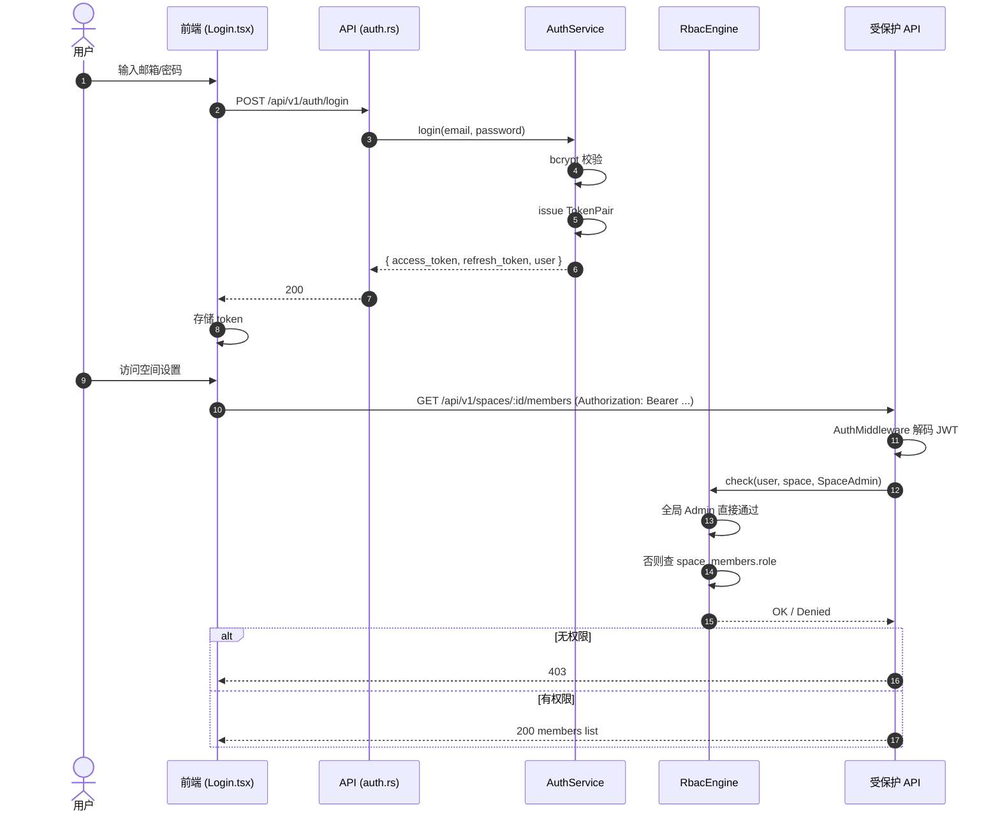
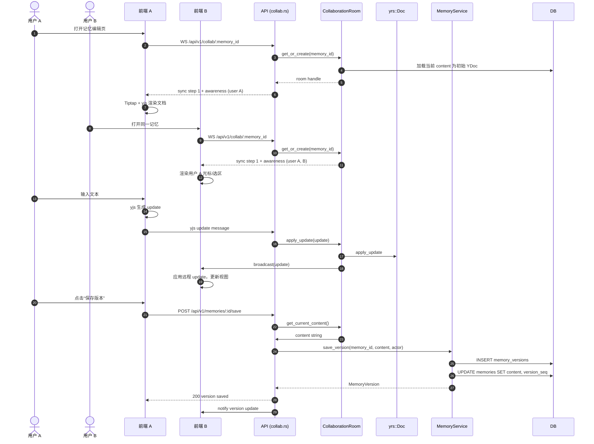
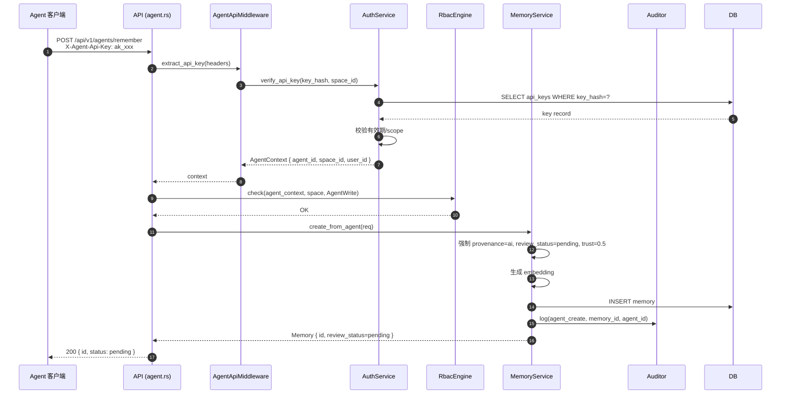
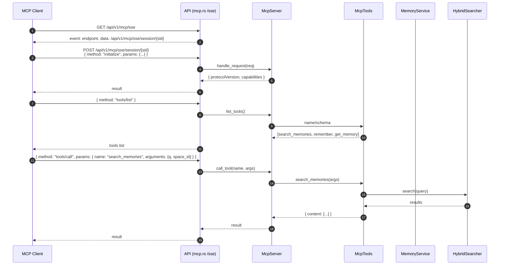
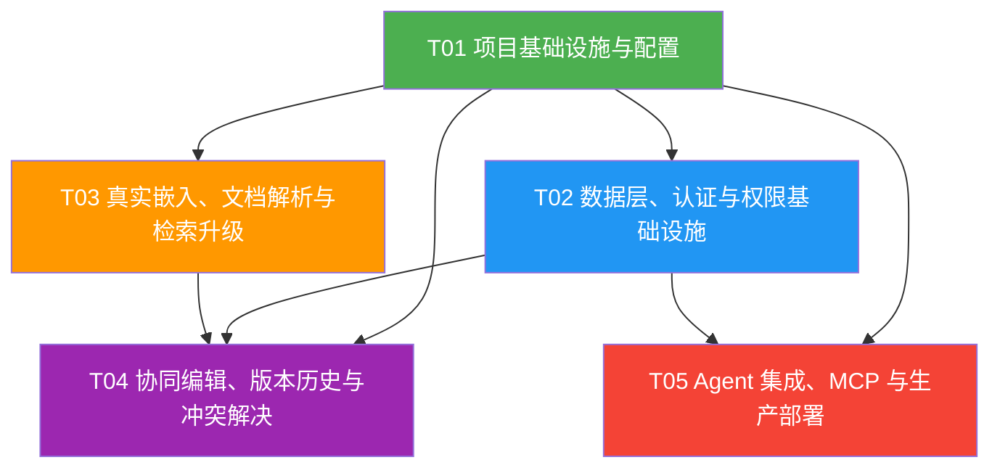

# epicode-kb v0.2.0 增量系统架构设计

> **文档版本**：v2.0
> **基线版本**：v0.1.0
> **日期**：2026-07-02
> **作者**：高见远（架构师）
> **状态**：待评审
> **关联 PRD**：`docs/prd/v2.md`
> **基线架构**：`docs/design/architecture.md`

---

## 目录

1. [实现方案概述](#1-实现方案概述)
2. [框架选型与依赖列表](#2-框架选型与依赖列表)
3. [文件列表](#3-文件列表)
4. [数据结构与接口设计](#4-数据结构与接口设计)
5. [程序调用流程](#5-程序调用流程)
6. [任务列表](#6-任务列表)
7. [共享知识](#7-共享知识跨文件约定)
8. [待明确事项](#8-待明确事项)
9. [风险与回退策略](#9-风险与回退策略)

---

## 1. 实现方案概述

### 1.1 总体目标

v0.2.0 将 epicode-kb 从“可运行的知识库骨架”升级为具备**真实语义理解、多人实时协同、企业级权限、Agent 接入与生产部署能力**的人机协同企业知识库。

### 1.2 与 v0.1.0 的核心差异

| 维度 | v0.1.0 现状 | v0.2.0 目标 | 影响范围 |
|------|------------|------------|---------|
| **嵌入模型** | `RandomEmbedder` 占位；`ort` 被注释 | 真实 ONNX 推理（`all-MiniLM-L6-v2`），可配置模型路径/维度 | `backend/src/embed/*`, `Cargo.toml`, Dockerfile |
| **文档解析** | Markdown/TXT 完整，PDF 为 ASCII fallback，无 DOCX | Markdown/TXT/PDF/DOCX 全格式解析，提取标题/作者/页码/章节元数据 | `backend/src/parse/*` |
| **文本分块** | 简单按段落/固定长度切分 | 可配置 chunk size / overlap / 句子边界，chunk 携带结构化元数据 | `backend/src/parse/chunker.rs` |
| **权限** | Header 透传 `X-Space-Id` / `X-User-Id`，无 RBAC | JWT access/refresh token；全局角色 + 空间角色；空间/记忆可见性；审计日志 | `backend/src/auth/*`, `api/*` |
| **协同编辑** | 未实现 | WebSocket + CRDT（`yrs`/`yjs`）实时协同；版本快照；diff/回退；冲突解决 UI | 新增 `backend/src/collab/*`, 前端编辑器 |
| **Agent 集成** | 未实现 | Agent API Key 认证；REST 搜索/写入；MCP Server（stdio + SSE）；AI 写入强制 `provenance=ai` | 新增 `backend/src/api/agent.rs`, `backend/src/mcp/*` |
| **部署** | 单容器 Docker Compose + 简单 CI | 多阶段 Docker、生产级 Docker Compose（PostgreSQL + pgvector）、Helm Chart、GitHub Actions CI/CD | `deploy/*`, `.github/workflows/*` |
| **可观测性** | 基础 tracing | `/metrics` Prometheus 端点；结构化日志；健康检查分 live/ready | `backend/src/observability/*` |

### 1.3 架构演进总览



### 1.4 关键技术挑战与应对方案

| 挑战 | 说明 | 应对方案 |
|------|------|---------|
| **ONNX 编译与分发** | `ort` 2.0 仍在 RC，多平台构建可能失败 | feature flag 隔离；Docker 多阶段构建预装模型；保留 RandomEmbedder 作为 CI/dev 兜底 |
| **CRDT 与 Rust 后端协同** | 前端 yjs 与后端 yrs 协议需对齐 | 自定义 Axum WebSocket handler，用 `yrs` 解码 `YDoc` update，持久化到 DB + 广播 |
| **RBAC 全接口改造** | 所有写接口需校验权限，回归成本高 | 先实现 `PermissionGuard` 中间件 + `require_permission` 辅助宏；按模块逐接口迁移并补测试 |
| **MCP 协议兼容性** | 协议仍在演进 | 紧跟 2024-12 MCP spec；抽象 `McpTool` trait，工具注册表便于增删 |
| **生产环境数据库切换** | SQLite 无法支撑并发写入与向量检索 | Docker Compose 提供 PostgreSQL + pgvector profile；SQLite 保留为 dev/轻量模式 |
| **Agent 写入安全隔离** | Agent 写入默认 pending，不可直接进入搜索结果 | `MemoryService::create` 强制覆盖 `provenance=ai`、`review_status=pending`；搜索默认过滤 accepted |

---

## 2. 框架选型与依赖列表

### 2.1 Rust crates（后端）

```toml
[dependencies]
# Web 框架
axum = { version = "0.7", features = ["multipart", "macros", "ws"] }
tokio = { version = "1.38", features = ["full"] }
tower = "0.5"
tower-http = { version = "0.6", features = ["cors", "trace", "fs"] }

# 数据库
rusqlite = { version = "0.31", features = ["bundled"] }

# 全文检索
tantivy = "0.22"

# ONNX 嵌入
ort = { version = "2.0.0-rc.10", features = ["download-binaries"] }
tokenizers = "0.19"
ndarray = "0.16"

# 文档解析
pulldown-cmark = "0.11"      # Markdown
pdf-extract = "0.8"          # PDF
docx-rs = "0.4"              # DOCX

# 认证与权限
jsonwebtoken = "9"
bcrypt = "0.15"
openidconnect = { version = "3", optional = true }  # P1

# 协同编辑 CRDT
yrs = "0.21"

# 序列化
serde = { version = "1.0", features = ["derive"] }
serde_json = "1.0"

# 错误处理
thiserror = "1.0"
anyhow = "1.0"

# 日志与可观测性
tracing = "0.1"
tracing-subscriber = { version = "0.3", features = ["env-filter", "json"] }
prometheus = "0.13"

# HTTP 客户端
reqwest = { version = "0.12", features = ["json", "stream"] }

# 工具
uuid = { version = "1.10", features = ["v4", "serde"] }
chrono = { version = "0.4", default-features = false, features = ["clock", "std"] }
async-trait = "0.1"
sha2 = "0.10"                # API Key hash
base64 = "0.22"              # API Key generation

# 配置
dotenvy = "0.15"

[features]
default = []
oidc = ["openidconnect"]
```

### 2.2 npm packages（前端）

```json
{
  "dependencies": {
    "react": "^19.0.0",
    "react-dom": "^19.0.0",
    "react-router-dom": "^6.24.0",
    "react-dropzone": "^14.2.0",
    "zod": "^3.23.0",
    "lucide-react": "^0.400.0",
    "yjs": "^13.6.0",
    "y-websocket": "^1.5.0",
    "@tiptap/react": "^2.5.0",
    "@tiptap/starter-kit": "^2.5.0",
    "@tiptap/collaboration": "^2.5.0",
    "@tiptap/collaboration-cursor": "^2.5.0",
    "diff-match-patch": "^1.0.5"
  },
  "devDependencies": {
    "@types/react": "^19.0.0",
    "@types/react-dom": "^19.0.0",
    "@types/diff-match-patch": "^1.0.36",
    "@vitejs/plugin-react": "^4.3.0",
    "vite": "^5.3.0",
    "typescript": "^5.5.0",
    "tailwindcss": "^3.4.0",
    "postcss": "^8.4.0",
    "autoprefixer": "^10.4.0"
  }
}
```

---

## 3. 文件列表

> 标注说明：✅ 复用/小改 | 🔶 较大改造 | ➕ 新增

### 3.1 后端文件

```
backend/
├── Cargo.toml                              🔶 新增 ONNX / 解析 / 认证 / CRDT / 可观测性依赖
├── src/
│   ├── main.rs                             🔶 初始化新状态、启动 ws 与 http
│   ├── lib.rs                              🔶 新增 collab / mcp / observability 模块声明
│   ├── config.rs                           🔶 新增 JWT / OIDC / 模型 / 队列 / 数据库类型配置
│   ├── state.rs                            🔶 新增 collab room manager、metrics、api key service
│   ├── error.rs                            🔶 新增 401/403/409 错误码与冲突错误
│   │
│   ├── api/
│   │   ├── mod.rs                          ✅
│   │   ├── routes.rs                       🔶 注册 agent / collab / mcp / auth 路由组
│   │   ├── memory.rs                       🔶 增加版本历史、可见性、权限校验
│   │   ├── search.rs                       ✅ 增加 visibility 过滤
│   │   ├── upload.rs                       🔶 chunker 与元数据
│   │   ├── auth.rs                         🔶 实现 login/refresh/logout
│   │   ├── agent.rs                        ➕ Agent API Key 路由
│   │   ├── collab.rs                       ➕ WebSocket 协同路由
│   │   └── mcp.rs                          ➕ MCP SSE / stdio 适配入口
│   │
│   ├── auth/
│   │   ├── mod.rs                          🔶
│   │   ├── model.rs                        🔶 新增 User/Role/Permission/SpaceRole
│   │   ├── jwt.rs                          ➕ JWT 生成、校验、刷新
│   │   ├── rbac.rs                         ➕ RBAC 决策引擎
│   │   ├── service.rs                      ➕ 登录、注册、OIDC 回调服务
│   │   └── middleware.rs                   🔶 JWT + RBAC + API Key 统一认证中间件
│   │
│   ├── collab/
│   │   ├── mod.rs                          ➕
│   │   ├── room.rs                         ➕ 协同房间：YDoc 状态、广播、持久化
│   │   └── protocol.rs                     ➕ yjs 协议消息解析与 yrs 转换
│   │
│   ├── db/
│   │   ├── mod.rs                          🔶 支持 SQLite / PostgreSQL 切换
│   │   ├── schema.rs                       🔶 引入 003_v2_schema.sql
│   │   ├── migrations/
│   │   │   ├── 001_init.sql                ✅
│   │   │   ├── 002_indexes.sql             ✅
│   │   │   └── 003_v2_schema.sql           ➕ v0.2.0 增量 schema
│   │   └── repository.rs                   🔶 新增 user/space_member/api_key/version/audit CRUD
│   │
│   ├── embed/
│   │   ├── mod.rs                          🔶 支持 ONNX / Random 动态选择
│   │   └── onnx.rs                         🔶 启用真实 ONNX 推理
│   │
│   ├── mcp/
│   │   ├── mod.rs                          ➕
│   │   ├── server.rs                       ➕ MCP Server 与工具注册
│   │   ├── tools.rs                        ➕ search_memories / remember / get_memory
│   │   ├── stdio.rs                        ➕ 标准输入输出传输
│   │   └── sse.rs                          ➕ SSE 远程传输
│   │
│   ├── observability/
│   │   ├── mod.rs                          ➕
│   │   ├── metrics.rs                      ➕ Prometheus /metrics 端点
│   │   └── audit.rs                        ➕ 审计日志统一写入
│   │
│   ├── parse/
│   │   ├── mod.rs                          🔶 新增 DOCX、chunker 注册
│   │   ├── markdown.rs                     ✅ 增强元数据提取
│   │   ├── text.rs                         ✅ 增强元数据提取
│   │   ├── pdf.rs                          🔶 启用 pdf-extract
│   │   ├── docx.rs                         ➕ DOCX 解析
│   │   └── chunker.rs                      ➕ 可配置分块策略
│   │
│   ├── search/
│   │   ├── mod.rs                          ✅
│   │   ├── semantic.rs                     ✅ 保持 SQLite BLOB 或切 pgvector
│   │   ├── fulltext.rs                     ✅ 增加 visibility 过滤字段
│   │   └── hybrid.rs                       ✅ 增加 visibility 过滤
│   │
│   └── memory/
│       ├── mod.rs                          ✅
│       ├── model.rs                        🔶 新增 Visibility / MemoryVersion
│       └── service.rs                      🔶 新增版本快照、协同保存、Agent 写入覆盖
```

### 3.2 前端文件

```
frontend/
├── package.json                            🔶 新增 yjs / tiptap / lucide / diff 依赖
├── vite.config.ts                          ✅
├── tsconfig.json                           ✅
├── src/
│   ├── main.tsx                            ✅
│   ├── App.tsx                             🔶 新增登录、Admin、Space、Memory、Agent 路由
│   ├── index.css                           🔶 新增 provenance/冲突高亮样式变量
│   │
│   ├── lib/
│   │   ├── types.ts                        🔶 新增 User / Role / ApiKey / MemoryVersion 类型
│   │   ├── api.ts                          🔶 新增 auth headers / 401 跳转 / 权限错误处理
│   │   ├── auth.ts                         ➕ JWT 存储、刷新、登出
│   │   └── collab.ts                       ➕ yjs provider 与 Tiptap 协同扩展封装
│   │
│   ├── trpc/
│   │   ├── client.ts                       ✅
│   │   └── router.ts                       ✅
│   │
│   ├── components/
│   │   ├── Layout.tsx                      🔶 按角色动态展示导航与操作
│   │   ├── MemoryCard.tsx                  ✅
│   │   ├── ProvenanceBadge.tsx             ✅
│   │   ├── TrustIndicator.tsx              ✅
│   │   ├── UploadZone.tsx                  ✅
│   │   ├── SearchFilters.tsx               ✅
│   │   ├── PermissionGuard.tsx             ➕ 按权限渲染子组件
│   │   ├── AwarenessCursors.tsx            ➕ 协同光标/选区渲染
│   │   └── ConflictResolutionModal.tsx     ➕ 冲突解决弹窗
│   │
│   └── pages/
│       ├── Home.tsx                        ✅
│       ├── Upload.tsx                      ✅
│       ├── Search.tsx                      ✅
│       ├── Review.tsx                      🔶 升级为审核队列
│       ├── Graph.tsx                       ✅
│       ├── Login.tsx                       ➕ 登录页
│       ├── AdminConsole.tsx                ➕ 用户/API Key/审计入口
│       ├── SpaceSettings.tsx               ➕ 空间成员、可见性、AI 写入开关
│       ├── MemoryEditor.tsx                ➕ 协同编辑器 + 版本抽屉
│       └── AgentIntegration.tsx            ➕ API Key 管理与 MCP 说明
```

### 3.3 部署与运维文件

```
├── backend/Dockerfile                      🔶 多阶段构建 + 非 root + healthcheck + 模型层
├── frontend/Dockerfile                     🔶 多阶段构建 + nginx + 非 root
│
├── deploy/
│   ├── docker-compose.yml                  🔶 默认 SQLite dev 模式
│   ├── docker-compose.prod.yml             ➕ PostgreSQL + pgvector + Nginx 生产模式
│   ├── .env.example                        🔶 新增 JWT / OIDC / 模型 / Agent 配置
│   │
│   └── helm/
│       └── epicode-kb/
│           ├── Chart.yaml                  ➕
│           ├── values.yaml                 ➕
│           ├── values.dev.yaml             ➕
│           ├── values.prod.yaml            ➕
│           └── templates/
│               ├── _helpers.tpl            ➕
│               ├── configmap.yaml          ➕
│               ├── secret.yaml             ➕
│               ├── backend-deployment.yaml ➕
│               ├── backend-service.yaml    ➕
│               ├── frontend-deployment.yaml➕
│               ├── frontend-service.yaml   ➕
│               ├── ingress.yaml            ➕
│               ├── hpa.yaml                ➕
│               └── migration-job.yaml      ➕
│
├── .github/
│   └── workflows/
│       ├── ci.yml                          🔶 增加 clippy 全 feature / 前端类型检查
│       └── release.yml                     ➕ buildx 多架构镜像 + Helm chart + Release
│
├── backend/.env.example                    🔶 新增 v0.2.0 配置项
└── scripts/
    └── dev.sh                              ✅
```

---

## 4. 数据结构与接口设计

### 4.1 ER 图（v0.2.0 数据模型）



### 4.2 核心枚举与类型

```rust
// ==================== auth/model.rs ====================

#[derive(Debug, Clone, Copy, PartialEq, Eq, Serialize, Deserialize)]
#[serde(rename_all = "lowercase")]
pub enum GlobalRole {
    Admin,
    Owner,
    Editor,
    Viewer,
}

#[derive(Debug, Clone, Copy, PartialEq, Eq, Serialize, Deserialize)]
#[serde(rename_all = "lowercase")]
pub enum SpaceRole {
    Owner,
    Editor,
    Viewer,
}

#[derive(Debug, Clone, Copy, PartialEq, Eq, Serialize, Deserialize)]
#[serde(rename_all = "snake_case")]
pub enum Permission {
    SpaceRead,
    SpaceWrite,
    SpaceAdmin,
    MemoryRead,
    MemoryWrite,
    MemoryAdmin,
    AgentWrite,
    ApiKeyManage,
}

// ==================== memory/model.rs ====================

#[derive(Debug, Clone, Copy, PartialEq, Eq, Serialize, Deserialize, Default)]
#[serde(rename_all = "snake_case")]
pub enum Visibility {
    #[default]
    Inherit,
    SpaceOnly,
    Private,
    Selected,
}

#[derive(Debug, Clone, Serialize, Deserialize)]
pub struct MemoryVersion {
    pub id: String,
    pub memory_id: String,
    pub space_id: String,
    pub version_seq: i64,
    pub content: String,
    pub editor_id: Option<String>,
    pub edit_summary: Option<String>,
    pub diff: Option<String>,
    pub created_at: i64,
}

#[derive(Debug, Clone, Serialize, Deserialize)]
pub struct ApiKey {
    pub id: String,
    pub space_id: String,
    pub user_id: String,
    pub key_hash: String,
    pub scope: String,
    pub name: String,
    pub expires_at: Option<i64>,
    pub last_used_at: Option<i64>,
    pub created_at: i64,
}
```

### 4.3 类图

```mermaid
classDiagram
    class User {
        +id: String
        +email: String
        +name: String
        +password_hash: Option~String~
        +sso_subject: Option~String~
        +global_role: GlobalRole
        +is_active: bool
        +created_at: i64
        +updated_at: i64
    }

    class GlobalRole {
        <<enum>>
        Admin
        Owner
        Editor
        Viewer
    }

    class SpaceRole {
        <<enum>>
        Owner
        Editor
        Viewer
    }

    class Permission {
        <<enum>>
        SpaceRead
        SpaceWrite
        SpaceAdmin
        MemoryRead
        MemoryWrite
        MemoryAdmin
        AgentWrite
        ApiKeyManage
    }

    class Space {
        +id: String
        +name: String
        +slug: String
        +description: Option~String~
        +visibility: SpaceVisibility
        +owner_id: String
        +ai_write_enabled: bool
        +created_at: i64
        +updated_at: i64
    }

    class SpaceVisibility {
        <<enum>>
        Public
        Team
        Private
    }

    class SpaceMember {
        +id: String
        +space_id: String
        +user_id: String
        +role: SpaceRole
        +created_at: i64
    }

    class ApiKey {
        +id: String
        +space_id: String
        +user_id: String
        +key_hash: String
        +scope: String
        +name: String
        +expires_at: Option~i64~
        +last_used_at: Option~i64~
    }

    class AuthService {
        -user_repo: UserRepo
        -jwt: JwtIssuer
        +login(email, password) Result~TokenPair~
        +refresh(token) Result~TokenPair~
        +register(req) Result~User~
        +verify_api_key(key, space_id) Result~AgentContext~
    }

    class RbacEngine {
        +check(user, space, permission) Result~
        +resolve_memory_visibility(user, memory) bool
    }

    class JwtIssuer {
        +issue(user_id, global_role) TokenPair
        +verify(access_token) Result~JwtClaims~
    }

    class Memory {
        +id: String
        +space_id: String
        +content: String
        +embedding: Option~Vec~f32~~
        +embedding_model: String
        +provenance: Provenance
        +trust_level: TrustLevel
        +review_status: ReviewStatus
        +visibility: Visibility
        +version_of: Option~String~
        +version_seq: i64
    }

    class Visibility {
        <<enum>>
        Inherit
        SpaceOnly
        Private
        Selected
    }

    class MemoryVersion {
        +id: String
        +memory_id: String
        +version_seq: i64
        +content: String
        +editor_id: Option~String~
        +diff: Option~String~
        +created_at: i64
    }

    class MemoryService {
        -repo: MemoryRepo
        -version_repo: MemoryVersionRepo
        -embedder: Arc~dyn EmbeddingProvider~
        -index: Arc~TantivyIndex~
        -auditor: Auditor
        +create(req, actor) Result~Memory~
        +create_from_agent(req) Result~Memory~
        +save_version(memory_id, content, actor) Result~MemoryVersion~
        +revert(memory_id, version_id, actor) Result~Memory~
        +resolve_conflict(memory_id, resolution, actor) Result~Memory~
    }

    class EmbeddingProvider {
        <<trait>>
        +embed(text) Result~Vec~f32~~
        +embed_batch(texts) Result~Vec~Vec~f32~~~
        +model_name() ~str
        +dimensions() usize
    }

    class OnnxEmbedder {
        -session: Session
        -tokenizer: Tokenizer
        -dim: usize
    }

    class DocumentParser {
        <<trait>>
        +parse(content) Result~Vec~MemoryChunk~~
        +supported_types() Vec~FileType~
    }

    class Chunker {
        +chunk(text, options) Vec~MemoryChunk~
        -split_by_sentence(text) Vec~String~
        -split_by_size(text, size, overlap) Vec~String~
    }

    class MemoryChunk {
        +content: String
        +chunk_index: usize
        +metadata: Option~Value~
    }

    class CollaborationRoom {
        -doc: Doc
        -awareness: Awareness
        -subscribers: Vec~WebSocket~
        -memory_id: String
        +apply_update(bytes)
        +broadcast(bytes, exclude)
        +persist_snapshot()
    }

    class McpServer {
        -tools: Map~String, McpTool~
        +handle_request(req) Result~Value~
        +register_tool(tool)
    }

    class McpTool {
        <<trait>>
        +name() ~str
        +description() ~str
        +schema() Value
        +execute(args) Result~Value~
    }

    class AgentApiMiddleware {
        +extract_api_key(headers) Option~String~
        +verify(key_hash) Result~AgentContext~
    }

    User --> GlobalRole
    Space --> SpaceVisibility
    SpaceMember --> SpaceRole
    Space ||--o{ SpaceMember : has
    User ||--o{ SpaceMember : belongs
    AuthService --> JwtIssuer
    AuthService --> RbacEngine
    RbacEngine --> Permission
    RbacEngine --> SpaceRole
    RbacEngine --> GlobalRole
    Memory --> Visibility
    MemoryService --> Memory
    MemoryService --> MemoryVersion
    MemoryService --> EmbeddingProvider
    EmbeddingProvider <|.. OnnxEmbedder
    DocumentParser ..> MemoryChunk : produces
    MemoryService ..> Chunker : uses
    CollaborationRoom --> MemoryService
    McpServer --> McpTool
    AgentApiMiddleware --> AuthService
```

---

## 5. 程序调用流程

### 5.1 文档上传 → 解析 → 分块 → Embedding → 写入



### 5.2 JWT 登录 + RBAC 权限校验



### 5.3 协同编辑同步流程



### 5.4 Agent API Key 写入记忆



### 5.5 MCP Server 工具调用（SSE 模式）



---

## 6. 任务列表

> **分解原则**：按功能模块/层次分组；每个任务包含多个相关文件；任务之间尽量减少线性依赖，T01 完成后 T02-T05 可高度并行。

### 6.1 任务依赖图



### 6.2 任务详情

---

#### T01：项目基础设施与配置

| 属性 | 内容 |
|------|------|
| **任务编号** | T01 |
| **任务名称** | 项目基础设施与配置 |
| **负责人** | 后端/前端工程师 |
| **优先级** | P0 |
| **前置依赖** | 无 |
| **源文件** | `backend/Cargo.toml`, `backend/src/main.rs`, `backend/src/lib.rs`, `backend/src/config.rs`, `backend/src/state.rs`, `backend/src/error.rs`, `frontend/package.json`, `frontend/vite.config.ts`, `frontend/tsconfig.json`, `frontend/src/main.tsx`, `frontend/src/App.tsx`, `frontend/src/index.css`, `backend/Dockerfile`, `frontend/Dockerfile` |
| **验收标准** | 1. `cargo build` 通过且新依赖可解析；2. `npm install && npm run dev` 启动前端；3. 后端启动后 `/api/v1/system/health` 返回 `{"code":0,"data":{"status":"ok"}}`；4. Dockerfile 多阶段构建通过且镜像非 root 运行；5. 新增配置项从环境变量读取并有默认值 |
| **核心内容** | 后端：添加 `ort`、`pdf-extract`、`docx-rs`、`jsonwebtoken`、`bcrypt`、`yrs`、`prometheus` 等依赖；扩展 `AppConfig` 支持 JWT secret、模型路径、数据库类型、OIDC、Agent 配置；扩展 `AppState` 预留 collab room manager、metrics、api key service 槽位；扩展 `AppError` 支持 401/403/409。前端：添加 `yjs`、`@tiptap/*`、`lucide-react`、`diff-match-patch`；扩展路由配置。部署：更新 Dockerfile 加入模型层、healthcheck、非 root 用户。 |

---

#### T02：数据层、认证与权限基础设施

| 属性 | 内容 |
|------|------|
| **任务编号** | T02 |
| **任务名称** | 数据层、认证与权限基础设施 |
| **负责人** | 后端工程师 |
| **优先级** | P0 |
| **前置依赖** | T01 |
| **源文件** | `backend/src/db/schema.rs`, `backend/src/db/migrations/003_v2_schema.sql`, `backend/src/db/mod.rs`, `backend/src/db/repository.rs`, `backend/src/auth/model.rs`, `backend/src/auth/jwt.rs`, `backend/src/auth/rbac.rs`, `backend/src/auth/service.rs`, `backend/src/auth/middleware.rs`, `backend/src/api/auth.rs`, `backend/src/api/routes.rs`, `backend/src/observability/mod.rs`, `backend/src/observability/audit.rs`, `backend/src/observability/metrics.rs` |
| **验收标准** | 1. `cargo test` 通过；2. 新 migration 在 SQLite 内存数据库成功执行；3. 未登录访问受保护接口返回 401；4. Viewer 调用 POST/PUT/DELETE 返回 403；5. 登录后获得有效 JWT；6. 审计日志表记录所有写操作；7. `/metrics` 暴露基础指标 |
| **核心内容** | 数据层：新增 `003_v2_schema.sql` 扩展 `users`/`spaces`/`memories`，新增 `memory_versions`、`memory_permissions`、`api_keys` 表及索引；repository 新增 `UserRepo`、`SpaceMemberRepo`、`ApiKeyRepo`、`MemoryVersionRepo`、`AuditRepo`。认证：实现 `AuthService`（bcrypt 密码、JWT 签发/校验/刷新）、`JwtIssuer`、`User`/`SpaceMember` 模型。权限：实现 `RbacEngine`，定义全局角色→权限、空间角色→权限的映射；实现 `AuthMiddleware` 统一处理 JWT 与 API Key，注入 `AuthContext`。可观测性：实现 `Auditor` 统一写入 `audit_logs`；实现 Prometheus `/metrics` 端点。 |

---

#### T03：真实嵌入、文档解析与检索升级

| 属性 | 内容 |
|------|------|
| **任务编号** | T03 |
| **任务名称** | 真实嵌入、文档解析与检索升级 |
| **负责人** | 后端工程师 |
| **优先级** | P0 |
| **前置依赖** | T01 |
| **源文件** | `backend/src/embed/mod.rs`, `backend/src/embed/onnx.rs`, `backend/src/parse/mod.rs`, `backend/src/parse/markdown.rs`, `backend/src/parse/text.rs`, `backend/src/parse/pdf.rs`, `backend/src/parse/docx.rs`, `backend/src/parse/chunker.rs`, `backend/src/search/mod.rs`, `backend/src/search/semantic.rs`, `backend/src/search/fulltext.rs`, `backend/src/search/hybrid.rs`, `backend/src/api/upload.rs`, `backend/src/api/search.rs`, `frontend/src/pages/Upload.tsx`, `frontend/src/pages/Search.tsx` |
| **验收标准** | 1. `OnnxEmbedder::embed("hello world")` 返回 384 维向量，两次相同文本余弦相似度 ≈ 1.0；2. Markdown/TXT/PDF/DOCX 上传均成功入库；3. chunk 平均长度可控且携带 source/heading/page 元数据；4. 语义搜索 top-1 命中同主题文档；5. 上传端点校验文件类型与大小；6. 搜索支持 visibility 过滤 |
| **核心内容** | 嵌入：`OnnxEmbedder` 启用真实 ONNX 推理（tokenize → ONNX inference → mean pooling → L2 normalize），`embed::create_embedder` 按模型文件存在性自动切换 ONNX/Random。解析：`PdfParser` 启用 `pdf-extract` 提取文本/页码；新增 `DocxParser` 用 `docx-rs` 提取段落/标题/作者；`MarkdownParser`/`TextParser` 增强元数据。分块：新增 `Chunker`，支持可配置 `chunk_size`、`overlap`、`split_by_sentence`，输出携带 `source`、`heading`、`page` 等元数据。检索：`HybridSearcher` 增加 visibility/review_status 过滤；Tantivy schema 增加 `visibility` 字段；上传后批量 embedding 写入。 |

---

#### T04：协同编辑、版本历史与冲突解决

| 属性 | 内容 |
|------|------|
| **任务编号** | T04 |
| **任务名称** | 协同编辑、版本历史与冲突解决 |
| **负责人** | 后端/前端工程师 |
| **优先级** | P0 |
| **前置依赖** | T01、T02、T03 |
| **源文件** | `backend/src/collab/mod.rs`, `backend/src/collab/room.rs`, `backend/src/collab/protocol.rs`, `backend/src/memory/model.rs`, `backend/src/memory/service.rs`, `backend/src/api/collab.rs`, `backend/src/api/memory.rs`, `backend/src/db/repository.rs`, `frontend/package.json`, `frontend/src/pages/MemoryEditor.tsx`, `frontend/src/components/AwarenessCursors.tsx`, `frontend/src/components/ConflictResolutionModal.tsx`, `frontend/src/lib/collab.ts`, `frontend/src/lib/types.ts` |
| **验收标准** | 1. 两个客户端同时编辑同一记忆，内容在 <300ms 内同步且不丢失；2. 保存版本后可在版本抽屉中查看历史；3. 回退版本后内容与旧版本一致；4. 并发保存冲突时 UI 出现冲突弹窗，提供 accept-mine/accept-theirs/edit-merge 操作；5. 冲突解决后生成 `provenance=co` 的新版本；6. 无权限用户无法进入编辑页 |
| **核心内容** | 后端：新增 `collab` 模块，用 `yrs::Doc` + `Awareness` 维护协同状态；`CollaborationRoom` 管理 WebSocket 订阅、apply update、broadcast；`protocol.rs` 处理 yjs 同步协议与 yrs 转换；`MemoryService` 新增 `save_version`、`revert`、`resolve_conflict`，写入 `memory_versions` 表并生成 diff。前端：集成 `@tiptap/react` + `@tiptap/collaboration` + `yjs` + 自定义 WebSocket provider 连接 Rust 后端；`AwarenessCursors` 渲染远程光标/选区；`ConflictResolutionModal` 使用 `diff-match-patch` 展示冲突区域并提供三态操作。 |

---

#### T05：Agent 集成、MCP 与生产部署

| 属性 | 内容 |
|------|------|
| **任务编号** | T05 |
| **任务名称** | Agent 集成、MCP 与生产部署 |
| **负责人** | 后端工程师 / SRE |
| **优先级** | P0 |
| **前置依赖** | T01、T02 |
| **源文件** | `backend/src/api/agent.rs`, `backend/src/api/routes.rs`, `backend/src/api/mcp.rs`, `backend/src/mcp/mod.rs`, `backend/src/mcp/server.rs`, `backend/src/mcp/tools.rs`, `backend/src/mcp/stdio.rs`, `backend/src/mcp/sse.rs`, `frontend/src/pages/AgentIntegration.tsx`, `frontend/src/lib/types.ts`, `deploy/docker-compose.yml`, `deploy/docker-compose.prod.yml`, `deploy/helm/epicode-kb/*`, `.github/workflows/ci.yml`, `.github/workflows/release.yml`, `backend/.env.example`, `deploy/.env.example` |
| **验收标准** | 1. 可创建/撤销 Agent API Key；2. Agent 调用搜索/写入接口成功，写入记忆的 `provenance=ai` 且 `review_status=pending`；3. MCP Client 可成功调用 `search_memories`/`remember`/`get_memory`；4. `docker compose up` 一键启动完整环境；5. `helm install` 成功且滚动更新无中断；6. GitHub Actions 在 PR 时触发检查，tag push 时发布镜像和 Helm chart；7. 生产配置通过 env/K8s Secret 注入，日志无密钥泄露 |
| **核心内容** | Agent：实现 `AgentApiMiddleware` 校验 `X-Agent-Api-Key`；实现 `/api/v1/agents/search`、`/api/v1/agents/remember`、`/api/v1/agents/memories/:id`；Agent 写入强制覆盖 `provenance=ai`。MCP：实现 `McpServer` 与 `McpTool` trait，注册 `search_memories`、`remember`、`get_memory`；实现 stdio 与 SSE 两种传输适配器。部署：更新 `docker-compose.yml` 支持 SQLite dev；新增 `docker-compose.prod.yml` 编排 PostgreSQL + pgvector + backend + frontend + Nginx；新增完整 Helm Chart（Deployment/Service/Ingress/ConfigMap/Secret/HPA/Migration Job）；新增 `release.yml` 实现 buildx 多架构镜像推送、Helm chart 打包、GitHub Release 发布；更新 `ci.yml` 增加全 feature clippy 与前端类型检查。 |

---

## 7. 共享知识（跨文件约定）

### 7.1 API 约定

- **统一响应格式**：`{ "code": 0, "data": T, "message": "ok" }`；错误码范围：`400xx` 客户端、`401xx` 认证、`403xx` 权限、`404xx` 资源、`409xx` 冲突、`500xx` 服务端。
- **认证方式**：
  - 人类用户：`Authorization: Bearer <JWT access_token>`。
  - Agent / MCP：`X-Agent-Api-Key: ak_xxx`。
- **时间戳**：所有 `*_at` 字段使用 **Unix 秒（i64）**。
- **ID 格式**：`usr_` / `sp_` / `mem_` / `ver_` / `key_` / `audit_` + UUID v4 去横线。
- **分页**：`limit`（默认 20，最大 100）+ `offset`（默认 0），响应含 `total`。

### 7.2 角色与权限映射

| 全局角色 | 权限 |
|---------|------|
| Admin | 所有空间的所有权限 + 用户管理 + API Key 管理 |
| Owner | 所有空间的所有权限（不能删全局用户） |
| Editor | 所有空间的 SpaceWrite/MemoryWrite |
| Viewer | 仅 SpaceRead/MemoryRead |

| 空间角色 | 权限 |
|---------|------|
| Owner | SpaceAdmin + MemoryAdmin + ApiKeyManage |
| Editor | SpaceRead + SpaceWrite + MemoryRead + MemoryWrite |
| Viewer | SpaceRead + MemoryRead |

### 7.3 可见性规则

- **空间可见性**：
  - `public`：所有登录用户可读。
  - `team`：仅空间成员可读。
  - `private`：仅 Owner/Editor/被邀请成员可读。
- **记忆可见性**：
  - `inherit`：继承空间可见性。
  - `space_only`：仅空间成员可见。
  - `private`：仅作者/空间 Owner 可见。
  - `selected`：仅 `memory_permissions` 中指定的用户可见。

### 7.4 Agent 写入强制规则

- 所有通过 Agent API / MCP `remember` 写入的记忆，后端强制覆盖：
  - `provenance = ai`
  - `review_status = pending`
  - `trust_level = 0.5`（除非空间 `ai_write_enabled=false` 直接拒绝）
- pending 状态的记忆默认不进入搜索结果，除非显式过滤 `review_status=pending`。

### 7.5 Embedding 与 Chunk 约定

- **默认模型**：`all-MiniLM-L6-v2`，384 维。
- **模型路径**：`EPICODE_KB_EMBED_MODEL` 环境变量，默认 `models/all-MiniLM-L6-v2.onnx`。
- **Chunk 元数据**：必须包含 `source`（文件类型）、`heading`（最近标题）、`page`（PDF/DOCX 页码）、`chunk_index`。
- **BLOB 序列化**：`Vec<f32>` 按 little-endian `f32::to_le_bytes()` 写入；反序列化按 4 字节 chunk 读取。

### 7.6 协同编辑约定

- WebSocket 路径：`/api/v1/collab/:memory_id`。
- 协议：yjs sync step 1/2 + update + awareness；后端用 `yrs` 解码。
- 保存版本：显式保存才生成 `memory_versions` 快照；自动协同状态不持久化到 `memories.content`，避免版本爆炸。
- 冲突定义：两个客户端几乎同时调用保存且 base version_seq 相同，后端检测 `version_seq` 已变，返回 409 并携带双方内容。

### 7.7 部署与配置约定

- **环境变量前缀**：`EPICODE_KB_*` 用于应用配置；`DEEPSEEK_*` 用于 LLM；`JWT_*` 用于认证。
- **生产数据库**：Docker Compose prod profile 使用 PostgreSQL 16 + pgvector；开发使用 SQLite。
- **密钥注入**：JWT secret、API Key salt、数据库密码、LLM key 必须通过环境变量或 K8s Secret 注入，禁止写入镜像或代码仓库。
- **健康检查**：
  - `/health/live`：进程存活。
  - `/health/ready`：DB、Tantivy、模型加载均就绪。

---

## 8. 待明确事项

| # | 问题 | 影响范围 | 建议方案 |
|---|------|---------|---------|
| Q1 | **嵌入模型选型**：默认继续 `all-MiniLM-L6-v2`（英文 384 维）还是换多语言/BGE？ | 搜索质量、镜像大小、中文场景 | P0 默认保留 MiniLM 以保证兼容性；通过 `EPICODE_KB_EMBED_MODEL` 与 `EPICODE_KB_EMBED_DIMENSIONS` 支持切换；v0.2.1 评估中文模型并补充测试集 |
| Q2 | **向量检索规模**：SQLite 全量加载 embedding 计算能支撑多大数量级？是否必须 P0 引入 pgvector？ | 架构复杂度、部署门槛、性能 | Docker Compose dev 保留 SQLite；prod profile 默认 PostgreSQL+pgvector；后端 repository 层抽象 `VectorStore` trait，便于后续切换 Qdrant/Milvus；P0 先完成 SQLite 路径，pgvector 作为 P0/P1 边界 |
| Q3 | **协同编辑实现路径**：后端纯 Rust `yrs` + Axum WebSocket，还是增加 Node y-websocket sidecar？ | 技术栈一致性、开发成本 | 优先 `yrs` + Axum WebSocket 保持纯 Rust；若工期紧张或协议调试困难，可在 T04 中期评估改为 Node y-websocket sidecar，需提前定义 sidecar 接口 |
| Q4 | **MCP 默认传输方式**：stdio（本地 Agent）还是 SSE/HTTP（远程 Agent）作为默认？ | Agent 接入形态、认证 | T05 同时实现 stdio 与 SSE 两种传输；文档给出两种示例；默认推荐 SSE 用于远程 Agent，stdio 用于本地 CLI/脚本 |
| Q5 | **记忆级 ACL 是否必须 P0 完整实现**：三级权限中的“记忆级”是否高频使用？ | 复杂度、性能、UX | P0 保留 `visibility` 字段与 `memory_permissions` 表，实现基础 `inherit/space_only/private` 校验；`selected` 完整 UI 与 ACL 管理放 P1 |
| Q6 | **OIDC/SSO 优先级**：企业刚需但工作量大，是否纳入 P0？ | 权限模块范围、里程碑 | P0 完成 JWT + 本地账号注册/登录；OIDC（Keycloak/Okta/Azure AD）放 P1，但 auth service 接口预留 `sso_callback` 与 `sso_subject` 字段 |

---

## 9. 风险与回退策略

| 风险 | 影响 | 可能性 | 回退策略 |
|------|------|--------|---------|
| `ort`/`pdf-extract`/`docx-rs` 编译失败或版本冲突 | 阻塞真实嵌入/解析 | 中 | 1. 用 Cargo feature flag 隔离，默认可关闭；2. CI 矩阵覆盖 Linux/macOS/Windows；3. 保留 `RandomEmbedder` 和 ASCII PDF fallback 作为编译期兜底 |
| CRDT 协同延迟 > 300ms 或出现内容丢失 | 用户体验差 | 中 | 1. 引入操作锁或乐观锁兜底；2. 冲突时回退到“保存-检测-合并”模式；3. 限制单房间并发人数并提供提示 |
| RBAC 改造引入大量回归 Bug | 延期、安全漏洞 | 中 | 1. 先实现 `PermissionGuard` 中间件，未迁移接口默认要求登录；2. 逐模块补单元测试 + 集成测试；3. 发布前做权限矩阵回归测试 |
| MCP 协议版本变更导致不兼容 | Agent 接入失败 | 低 | 1. 紧跟 2024-12 spec；2. `McpTool` trait 抽象工具层；3. 版本化 MCP endpoint（`/api/v1/mcp` 保留，后续 `/api/v2/mcp` 升级） |
| PostgreSQL/pgvector 增加部署门槛 | 小企业采用阻力 | 中 | 1. Docker Compose 同时提供 SQLite dev profile；2. Helm values 提供最小资源模板；3. 文档包含一键启动脚本与备份/恢复指南 |
| JWT secret / API Key 泄露 | 严重安全事件 | 低 | 1. 所有密钥通过 env/K8s Secret 注入；2. API Key 存储为 sha256 hash，不存储明文；3. 支持 API Key 撤销与审计；4. 生产镜像不携带 `.env` |
| 前端协同编辑器包体积过大 | 首屏加载慢 | 中 | 1. 按路由懒加载 `MemoryEditor`；2. 评估 `@tiptap` 与纯 `yjs` 方案体积差异；3. 生产构建启用 gzip/brotli |

---

> **本文档为 epicode-kb v0.2.0 增量架构设计，聚焦 v0.1.0 到 v0.2.0 的增量能力。详细接口实现以各任务代码与单元测试为准。**
