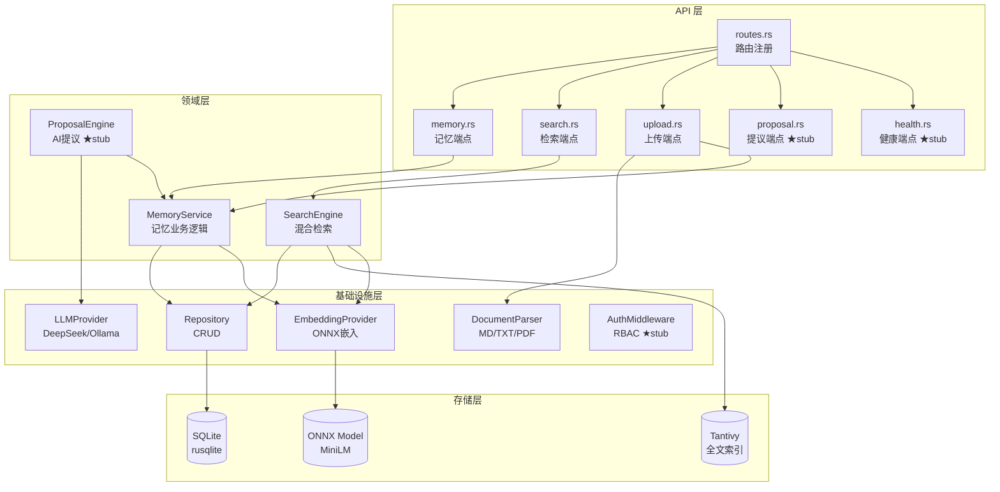
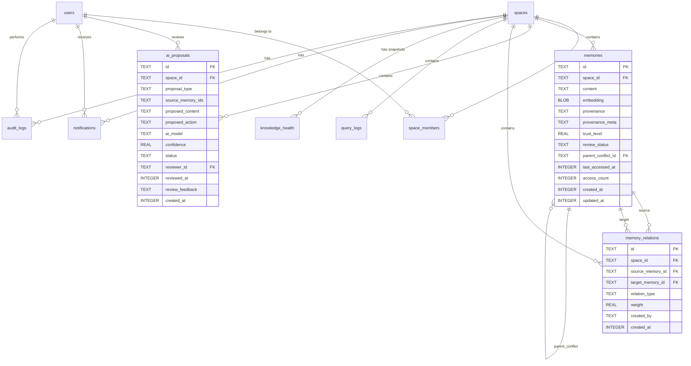
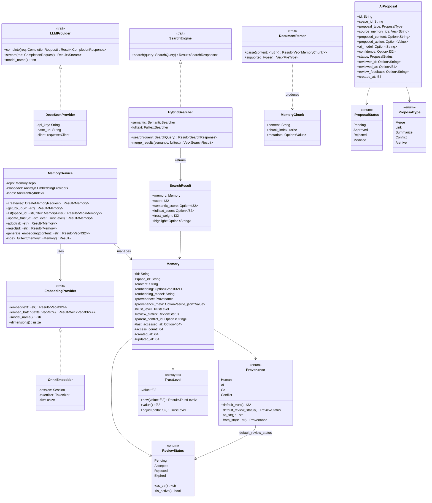
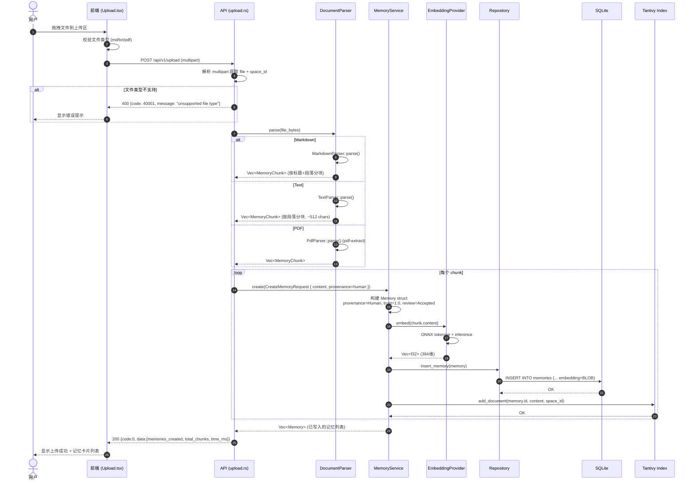
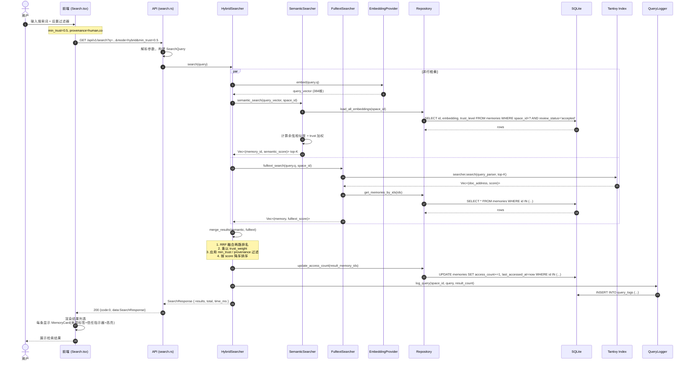
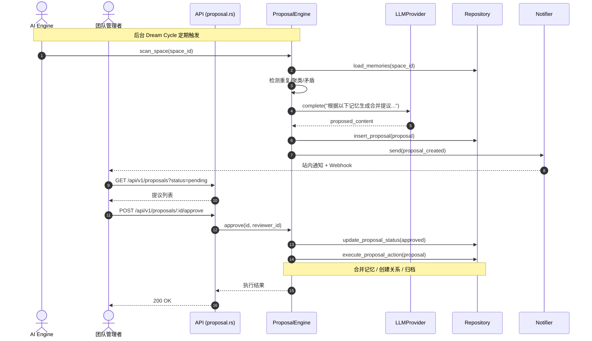
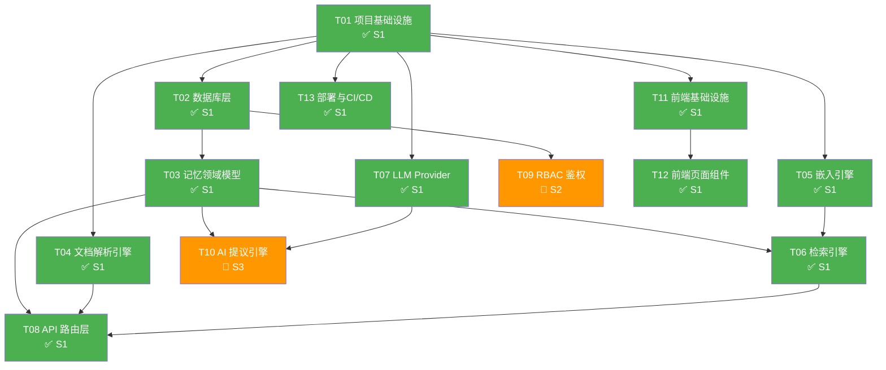

# epicode-kb 系统架构设计文档

> **文档版本**：v1.0
> **日期**：2026-06-25
> **作者**：高见远（架构师）
> **状态**：待评审
> **关联 PRD**：`docs/prd/v1.md`

---

## 目录

1. [实现方案概述](#1-实现方案概述)
2. [完整目录结构](#2-完整目录结构)
3. [数据模型（SQL）](#3-数据模型sql)
4. [API 设计](#4-api-设计)
5. [核心数据结构（Rust）](#5-核心数据结构rust)
6. [程序调用流程](#6-程序调用流程)
7. [任务列表](#7-任务列表)
8. [依赖包列表](#8-依赖包列表)
9. [共享知识](#9-共享知识跨文件约定)
10. [待明确事项](#10-待明确事项)

---

## 1. 实现方案概述

### 1.1 核心技术挑战

| 挑战 | 说明 | 应对方案 |
|------|------|---------|
| **记忆溯源链路** | 每条记忆必须携带 provenance/trust_level/review_status，贯穿写入→存储→检索→展示全链路 | 领域模型层统一封装 `Memory` struct，API 层强制校验，DB schema 字段 NOT NULL DEFAULT |
| **混合检索** | 语义向量检索 + Tantivy 全文检索需融合排序，且按 trust_level 加权 | `SearchEngine` trait 统一接口，`HybridSearcher` 负责分数融合（RRF + trust 加权） |
| **本地嵌入推理** | ONNX Runtime 本地 embedding，不依赖外部 API，隐私友好 | `ort` crate（ONNX Runtime Rust binding），预加载 `all-MiniLM-L6-v2` 模型 |
| **Rust ↔ tRPC 类型共享** | tRPC 原生 TS，Rust 后端需手动维护类型一致性 | 后端用 `serde` 序列化，前端用 `zod` schema 校验响应，手写类型映射层 |
| **SQLite 向量存储** | MVP 不引入独立向量库，embedding 存为 BLOB，需支持相似度计算 | `rusqlite` + 存储为 `[f32; N]` 的 BLOB，检索时全量加载计算余弦相似度（10 万级可接受） |
| **模块化脚手架** | Sprint 1 只实现 3 个 P0，但完整目录结构和接口需预留 | 所有模块创建 `mod.rs`，未实现的功能返回 `501 Not Implemented` + TODO 注释 |

### 1.2 技术选型与理由

| 层 | 技术 | 版本 | 选型理由 |
|----|------|------|---------|
| 后端语言 | Rust | 1.78+ | 性能 + 内存安全 + 与 Epicode 设计理念一致 |
| Web 框架 | Axum | 0.7 | 异步生态成熟，Tower 中间件丰富，类型安全路由 |
| 数据库（MVP） | SQLite | via rusqlite 0.31 | 零配置启动，单文件部署，开发友好 |
| 数据库（生产） | PostgreSQL + pgvector | 16+ | 企业级可靠性，JSONB，并发性能，向量扩展 |
| 全文检索 | Tantivy | 0.22 | Rust 原生全文搜索引擎，高性能，无外部依赖 |
| 嵌入推理 | ONNX Runtime | via ort 2.x | 本地推理，隐私友好，跨平台 |
| LLM | DeepSeek（MVP）/ Ollama / OpenAI | — | 可配置切换，DeepSeek 性价比高 |
| 前端框架 | React | 19 | 并发渲染，生态最大 |
| 构建工具 | Vite | 5 | 极速 HMR，ESM 原生 |
| UI 样式 | Tailwind CSS | 3.4 | 原子化 CSS，快速迭代 |
| API 层 | tRPC | 11 | 端到端类型安全（前端内部路由） |
| 图谱可视化 | Cytoscape.js | 3.30 | 图谱交互开箱即用，P0-6 使用 |
| 部署 | Docker Compose | — | MVP 部署方案，简单可靠 |

### 1.3 架构模式

采用 **分层架构 + 领域驱动设计（DDD-Lite）**：

```
┌──────────────────────────────────────────────────────┐
│                   API 路由层 (Axum)                    │
│  routes.rs · memory.rs · search.rs · upload.rs · ...  │
├──────────────────────────────────────────────────────┤
│                   领域服务层                            │
│  memory/service · search/hybrid · dream/proposal      │
├──────────────────────────────────────────────────────┤
│                   基础设施层                            │
│  db/repository · embed/onnx · parse/* · llm/*         │
├──────────────────────────────────────────────────────┤
│                   数据存储层                            │
│  SQLite (rusqlite) · Tantivy Index · ONNX Model       │
└──────────────────────────────────────────────────────┘
```

**关键设计原则**：
- **领域模型不可绕过**：所有 Memory 写入/读取必须经过 `MemoryService`，确保 provenance/trust 校验
- **Provider 可替换**：LLM 和 Embedding 均通过 trait 抽象，运行时可切换实现
- **Sprint 渐进**：未实现的模块返回 `501`，但接口和数据结构已定义

### 1.4 模块划分总览



---

## 2. 完整目录结构

> 标注说明：✅ Sprint 1 实现 | 🔶 Sprint 1 stub（接口定义+TODO）| 📦 Sprint 2+ 后续实现

```
epicode-kb/
├── backend/
│   ├── src/
│   │   ├── main.rs                    # ✅ 入口：初始化 AppState，启动 Axum server
│   │   ├── lib.rs                     # ✅ 模块声明
│   │   ├── config.rs                  # ✅ 配置加载（环境变量 + 默认值）
│   │   ├── error.rs                   # ✅ 统一错误类型 AppError + IntoResponse
│   │   ├── state.rs                   # ✅ AppState（DB pool, Tantivy index, ONNX session）
│   │   │
│   │   ├── api/                       # API 路由层
│   │   │   ├── mod.rs                 # ✅ 模块声明
│   │   │   ├── routes.rs              # ✅ 路由注册（Router 组装）
│   │   │   ├── memory.rs              # ✅ 记忆端点：POST /remember, GET /memories/:id, trust/adopt/reject
│   │   │   ├── search.rs              # ✅ 检索端点：GET /search, POST /recall
│   │   │   ├── upload.rs              # ✅ 上传端点：POST /upload（multipart）
│   │   │   ├── proposal.rs            # 🔶 提议端点：GET/POST /proposals/*（501 stub）
│   │   │   ├── health.rs              # 🔶 健康端点：GET /health/*（501 stub）
│   │   │   └── auth.rs                # 🔶 认证端点：POST /auth/login（501 stub）
│   │   │
│   │   ├── db/                        # 数据库层
│   │   │   ├── mod.rs                 # ✅ 模块声明 + 连接池初始化
│   │   │   ├── schema.rs              # ✅ 建表 SQL 常量
│   │   │   ├── migrations/            # ✅ SQL 迁移文件
│   │   │   │   ├── 001_init.sql       # ✅ 初始 schema
│   │   │   │   └── 002_indexes.sql    # ✅ 索引
│   │   │   └── repository.rs          # ✅ CRUD 操作（MemoryRepo, ProposalRepo, etc.）
│   │   │
│   │   ├── memory/                    # 记忆领域模型
│   │   │   ├── mod.rs                 # ✅ 模块声明
│   │   │   ├── model.rs               # ✅ Memory, Provenance, TrustLevel, ReviewStatus
│   │   │   └── service.rs             # ✅ MemoryService：写入/读取/信任调整/采纳拒绝
│   │   │
│   │   ├── search/                    # 检索引擎
│   │   │   ├── mod.rs                 # ✅ 模块声明 + SearchEngine trait
│   │   │   ├── semantic.rs            # ✅ 向量语义检索（余弦相似度）
│   │   │   ├── fulltext.rs            # ✅ Tantivy 全文检索
│   │   │   └── hybrid.rs              # ✅ 混合排序（RRF + trust 加权）
│   │   │
│   │   ├── embed/                     # 嵌入引擎
│   │   │   ├── mod.rs                 # ✅ EmbeddingProvider trait
│   │   │   └── onnx.rs                # ✅ ONNX Runtime 实现（all-MiniLM-L6-v2）
│   │   │
│   │   ├── parse/                     # 文档解析
│   │   │   ├── mod.rs                 # ✅ DocumentParser trait + 工厂
│   │   │   ├── markdown.rs            # ✅ Markdown 解析 + 分块
│   │   │   ├── text.rs                # ✅ 纯文本解析 + 分块
│   │   │   └── pdf.rs                 # 🔶 PDF 基础解析（pdf-extract crate）
│   │   │
│   │   ├── llm/                       # LLM Provider 抽象
│   │   │   ├── mod.rs                 # ✅ LLMProvider trait + 工厂
│   │   │   ├── deepseek.rs            # ✅ DeepSeek API 实现
│   │   │   └── ollama.rs              # 🔶 Ollama 本地部署（stub）
│   │   │
│   │   ├── auth/                      # RBAC 鉴权
│   │   │   ├── mod.rs                 # 🔶 模块声明
│   │   │   ├── model.rs               # 🔶 User, Role, Space, Permission
│   │   │   └── middleware.rs          # 🔶 AuthMiddleware（501 stub）
│   │   │
│   │   ├── dream/                     # AI 提议引擎
│   │   │   ├── mod.rs                 # 🔶 模块声明
│   │   │   └── proposal.rs            # 🔶 ProposalEngine（501 stub）
│   │   │
│   │   └── notify/                    # 通知系统
│   │       ├── mod.rs                 # 🔶 Notifier trait
│   │       └── webhook.rs             # 🔶 Webhook 通知（stub）
│   │
│   ├── tests/                         # 集成测试
│   │   ├── memory_test.rs             # ✅ 记忆写入/检索测试
│   │   └── search_test.rs             # ✅ 混合检索测试
│   ├── Cargo.toml                     # ✅ 依赖声明
│   ├── Dockerfile                     # ✅ 后端容器镜像
│   └── .env.example                   # ✅ 环境变量模板
│
├── frontend/
│   ├── src/
│   │   ├── main.tsx                   # ✅ 入口
│   │   ├── App.tsx                    # ✅ 根组件 + 路由
│   │   ├── pages/
│   │   │   ├── Home.tsx               # ✅ 首页（概览 + 快捷入口）
│   │   │   ├── Upload.tsx             # ✅ 上传页（拖拽上传 + 解析状态）
│   │   │   ├── Search.tsx             # ✅ 检索页（混合检索 + 过滤 + 结果列表）
│   │   │   ├── Review.tsx             # 🔶 审核队列页（stub 占位）
│   │   │   └── Graph.tsx              # 🔶 知识图谱页（stub 占位）
│   │   ├── components/
│   │   │   ├── MemoryCard.tsx         # ✅ 记忆卡片（来源标签 + 信任指示器 + 审核状态）
│   │   │   ├── ProvenanceBadge.tsx    # ✅ 来源标签组件（🟢人类 🟣AI 🟢协同 🔴冲突）
│   │   │   ├── TrustIndicator.tsx     # ✅ 信任指示器（进度条 + 数值）
│   │   │   ├── UploadZone.tsx         # ✅ 拖拽上传区域
│   │   │   ├── SearchFilters.tsx      # ✅ 检索过滤器（min_trust + provenance）
│   │   │   └── Layout.tsx             # ✅ 全局布局（导航栏 + 内容区）
│   │   ├── trpc/
│   │   │   ├── client.ts              # ✅ tRPC 客户端初始化
│   │   │   └── router.ts              # ✅ tRPC 路由定义（前端内部路由）
│   │   ├── lib/
│   │   │   ├── api.ts                 # ✅ HTTP API 封装（fetch wrapper）
│   │   │   └── types.ts               # ✅ 共享类型定义（与后端对齐）
│   │   └── index.css                  # ✅ Tailwind 入口 + 全局样式
│   ├── public/
│   │   └── favicon.svg                # ✅ 站点图标
│   ├── index.html                     # ✅ HTML 模板
│   ├── vite.config.ts                 # ✅ Vite 配置
│   ├── tailwind.config.ts             # ✅ Tailwind 配置
│   ├── tsconfig.json                  # ✅ TypeScript 配置
│   ├── package.json                   # ✅ 依赖声明
│   └── Dockerfile                     # ✅ 前端容器镜像
│
├── deploy/
│   ├── docker-compose.yml             # ✅ 编排文件（backend + frontend）
│   └── .env.example                   # ✅ 环境变量模板
│
├── docs/
│   ├── prd/v1.md                      # ✅ 产品需求文档
│   ├── design/
│   │   └── architecture.md            # ✅ 本文档
│   ├── sequence-diagram.mermaid       # ✅ 时序图
│   └── class-diagram.mermaid          # ✅ 类图
│
├── scripts/
│   └── dev.sh                         # ✅ 开发启动脚本（同时启动前后端）
│
├── .github/
│   └── workflows/
│       └── ci.yml                     # ✅ CI 流水线
│
├── .gitignore                         # ✅
├── README.md                          # ✅
├── LICENSE                            # ✅
└── version.txt                        # ✅
```

---

## 3. 数据模型（SQL）

> 基于 PRD 5.3 节，补全 `users`、`spaces`、`space_members`、`memory_relations`、`notifications`、`audit_logs` 表。

### 3.1 完整建表 SQL

```sql
-- ============================================================
-- Migration: 001_init.sql
-- Description: epicode-kb 初始 schema
-- ============================================================

-- -------------------------------------------------------
-- 用户表（RBAC 基础）
-- -------------------------------------------------------
CREATE TABLE IF NOT EXISTS users (
    id          TEXT PRIMARY KEY,
    email       TEXT UNIQUE NOT NULL,
    name        TEXT NOT NULL,
    global_role TEXT NOT NULL DEFAULT 'viewer',  -- admin|owner|editor|viewer
    created_at  INTEGER NOT NULL,
    updated_at  INTEGER NOT NULL
);

-- -------------------------------------------------------
-- 空间表（多租户逻辑隔离）
-- -------------------------------------------------------
CREATE TABLE IF NOT EXISTS spaces (
    id                      TEXT PRIMARY KEY,
    name                    TEXT NOT NULL,
    description             TEXT,
    ai_write_enabled        INTEGER NOT NULL DEFAULT 1,   -- 0|1
    default_ai_trust_level  REAL NOT NULL DEFAULT 0.5,     -- 0.0~1.0
    retention_days          INTEGER,                       -- NULL = 永久保留
    created_at              INTEGER NOT NULL,
    updated_at              INTEGER NOT NULL
);

-- -------------------------------------------------------
-- 空间成员表（空间级 RBAC）
-- -------------------------------------------------------
CREATE TABLE IF NOT EXISTS space_members (
    id         TEXT PRIMARY KEY,
    space_id   TEXT NOT NULL REFERENCES spaces(id) ON DELETE CASCADE,
    user_id    TEXT NOT NULL REFERENCES users(id) ON DELETE CASCADE,
    role       TEXT NOT NULL DEFAULT 'viewer',  -- owner|editor|viewer
    created_at INTEGER NOT NULL,
    UNIQUE(space_id, user_id)
);

-- -------------------------------------------------------
-- 记忆表（核心）
-- -------------------------------------------------------
CREATE TABLE IF NOT EXISTS memories (
    id                 TEXT PRIMARY KEY,
    space_id           TEXT NOT NULL REFERENCES spaces(id) ON DELETE CASCADE,
    content            TEXT NOT NULL,
    embedding          BLOB,                            -- [f32; 384] 序列化为 BLOB
    embedding_model    TEXT DEFAULT 'all-MiniLM-L6-v2',
    provenance         TEXT NOT NULL DEFAULT 'human',   -- human|ai|co|conflict
    provenance_meta    TEXT,                             -- JSON: {source, author, model, ...}
    trust_level        REAL NOT NULL DEFAULT 1.0,       -- 0.0~1.0
    review_status      TEXT NOT NULL DEFAULT 'accepted', -- pending|accepted|rejected|expired
    parent_conflict_id TEXT REFERENCES memories(id),
    last_accessed_at   INTEGER,
    access_count       INTEGER NOT NULL DEFAULT 0,
    created_at         INTEGER NOT NULL,
    updated_at         INTEGER NOT NULL
);

-- -------------------------------------------------------
-- AI 提议表
-- -------------------------------------------------------
CREATE TABLE IF NOT EXISTS ai_proposals (
    id                 TEXT PRIMARY KEY,
    space_id           TEXT NOT NULL REFERENCES spaces(id) ON DELETE CASCADE,
    proposal_type      TEXT NOT NULL,                -- merge|link|summarize|conflict|archive
    source_memory_ids  TEXT NOT NULL,                -- JSON array of memory IDs
    proposed_content   TEXT,
    proposed_action    TEXT,                          -- JSON: 具体操作描述
    ai_model           TEXT,
    confidence         REAL,                          -- 0.0~1.0
    status             TEXT NOT NULL DEFAULT 'pending', -- pending|approved|rejected|modified
    reviewer_id        TEXT REFERENCES users(id),
    reviewed_at        INTEGER,
    review_feedback    TEXT,
    created_at         INTEGER NOT NULL
);

-- -------------------------------------------------------
-- 记忆关系表（知识图谱）
-- -------------------------------------------------------
CREATE TABLE IF NOT EXISTS memory_relations (
    id                 TEXT PRIMARY KEY,
    space_id           TEXT NOT NULL REFERENCES spaces(id) ON DELETE CASCADE,
    source_memory_id   TEXT NOT NULL REFERENCES memories(id) ON DELETE CASCADE,
    target_memory_id   TEXT NOT NULL REFERENCES memories(id) ON DELETE CASCADE,
    relation_type      TEXT NOT NULL,                 -- link|merge|conflict|summary
    weight             REAL DEFAULT 1.0,
    created_by         TEXT,                          -- user_id or 'ai'
    created_at         INTEGER NOT NULL,
    UNIQUE(source_memory_id, target_memory_id, relation_type)
);

-- -------------------------------------------------------
-- 查询日志（知识缺口检测）
-- -------------------------------------------------------
CREATE TABLE IF NOT EXISTS query_logs (
    id           TEXT PRIMARY KEY,
    space_id     TEXT NOT NULL REFERENCES spaces(id) ON DELETE CASCADE,
    user_id      TEXT REFERENCES users(id),
    query        TEXT NOT NULL,
    result_count INTEGER NOT NULL,
    query_type   TEXT NOT NULL,                       -- search|recall|ask
    filters      TEXT,                                -- JSON: applied filters
    created_at   INTEGER NOT NULL
);

-- -------------------------------------------------------
-- 知识健康度快照
-- -------------------------------------------------------
CREATE TABLE IF NOT EXISTS knowledge_health (
    id              TEXT PRIMARY KEY,
    space_id        TEXT NOT NULL REFERENCES spaces(id) ON DELETE CASCADE,
    snapshot_date   TEXT NOT NULL,                    -- YYYY-MM-DD
    total_memories  INTEGER,
    human_ratio     REAL,
    ai_ratio        REAL,
    co_ratio        REAL,
    conflict_count  INTEGER,
    avg_trust       REAL,
    stale_count     INTEGER,
    orphan_count    INTEGER,
    gap_count       INTEGER,
    health_score    REAL,
    created_at      INTEGER NOT NULL,
    UNIQUE(space_id, snapshot_date)
);

-- -------------------------------------------------------
-- 通知表
-- -------------------------------------------------------
CREATE TABLE IF NOT EXISTS notifications (
    id         TEXT PRIMARY KEY,
    space_id   TEXT NOT NULL REFERENCES spaces(id) ON DELETE CASCADE,
    user_id    TEXT REFERENCES users(id),             -- NULL = 空间广播
    type       TEXT NOT NULL,                         -- proposal|conflict|health|system
    title      TEXT NOT NULL,
    body       TEXT,
    ref_id     TEXT,                                  -- 关联实体 ID
    ref_type   TEXT,                                  -- proposal|memory|conflict
    read       INTEGER NOT NULL DEFAULT 0,
    created_at INTEGER NOT NULL
);

-- -------------------------------------------------------
-- 审计日志
-- -------------------------------------------------------
CREATE TABLE IF NOT EXISTS audit_logs (
    id          TEXT PRIMARY KEY,
    space_id    TEXT NOT NULL,
    user_id     TEXT,
    action      TEXT NOT NULL,                        -- create|update|delete|adopt|reject|approve
    entity_type TEXT NOT NULL,                        -- memory|proposal|space|user
    entity_id   TEXT,
    details     TEXT,                                 -- JSON
    created_at  INTEGER NOT NULL
);
```

### 3.2 索引 SQL

```sql
-- ============================================================
-- Migration: 002_indexes.sql
-- ============================================================

CREATE INDEX IF NOT EXISTS idx_memories_space        ON memories(space_id);
CREATE INDEX IF NOT EXISTS idx_memories_provenance    ON memories(space_id, provenance);
CREATE INDEX IF NOT EXISTS idx_memories_trust         ON memories(space_id, trust_level);
CREATE INDEX IF NOT EXISTS idx_memories_review        ON memories(space_id, review_status);
CREATE INDEX IF NOT EXISTS idx_memories_created       ON memories(space_id, created_at DESC);

CREATE INDEX IF NOT EXISTS idx_proposals_space_status ON ai_proposals(space_id, status);
CREATE INDEX IF NOT EXISTS idx_proposals_created      ON ai_proposals(created_at DESC);

CREATE INDEX IF NOT EXISTS idx_relations_source       ON memory_relations(source_memory_id);
CREATE INDEX IF NOT EXISTS idx_relations_target       ON memory_relations(target_memory_id);
CREATE INDEX IF NOT EXISTS idx_relations_space        ON memory_relations(space_id, relation_type);

CREATE INDEX IF NOT EXISTS idx_query_logs_space       ON query_logs(space_id, created_at DESC);
CREATE INDEX IF NOT EXISTS idx_query_logs_zero        ON query_logs(space_id, result_count) WHERE result_count = 0;

CREATE INDEX IF NOT EXISTS idx_notifications_user     ON notifications(user_id, read, created_at DESC);
CREATE INDEX IF NOT EXISTS idx_notifications_space    ON notifications(space_id, created_at DESC);

CREATE INDEX IF NOT EXISTS idx_audit_space            ON audit_logs(space_id, created_at DESC);
CREATE INDEX IF NOT EXISTS idx_audit_entity           ON audit_logs(entity_type, entity_id);

CREATE INDEX IF NOT EXISTS idx_space_members_user     ON space_members(user_id);
CREATE INDEX IF NOT EXISTS idx_space_members_space    ON space_members(space_id);
```

### 3.3 ER 图



---

## 4. API 设计

### 4.1 API 路由总览

| 方法 | 路径 | 描述 | Sprint |
|------|------|------|--------|
| `POST` | `/api/v1/remember` | 写入记忆（支持 provenance） | ✅ S1 |
| `GET` | `/api/v1/memories/:id` | 获取单条记忆详情 | ✅ S1 |
| `GET` | `/api/v1/memories` | 列出记忆（分页 + 过滤） | ✅ S1 |
| `POST` | `/api/v1/memories/:id/trust` | 调整信任等级 | ✅ S1 |
| `POST` | `/api/v1/memories/:id/adopt` | 采纳 AI 记忆 | ✅ S1 |
| `POST` | `/api/v1/memories/:id/reject` | 拒绝 AI 记忆 | ✅ S1 |
| `GET` | `/api/v1/search` | 混合检索（语义 + 全文） | ✅ S1 |
| `POST` | `/api/v1/recall` | 上下文召回 | ✅ S1 |
| `POST` | `/api/v1/upload` | 文档上传（multipart） | ✅ S1 |
| `GET` | `/api/v1/proposals` | 列出待审核提议 | 🔶 S3 |
| `POST` | `/api/v1/proposals/:id/approve` | 批准提议 | 🔶 S3 |
| `POST` | `/api/v1/proposals/:id/reject` | 拒绝提议 | 🔶 S3 |
| `POST` | `/api/v1/proposals/:id/modify` | 修改后采纳 | 🔶 S3 |
| `GET` | `/api/v1/graph` | 知识图谱数据 | 🔶 S2 |
| `GET` | `/api/v1/health/space/:id` | 空间健康度 | 🔶 S5 |
| `GET` | `/api/v1/health/gaps` | 知识缺口 | 🔶 S5 |
| `POST` | `/api/v1/health/scan` | 手动触发扫描 | 🔶 S5 |
| `GET` | `/api/v1/conflicts` | 列出未解决冲突 | 🔶 S4 |
| `POST` | `/api/v1/conflicts/:id/resolve` | 解决冲突 | 🔶 S4 |
| `POST` | `/api/v1/auth/login` | 登录 | 🔶 S2 |
| `GET` | `/api/v1/spaces` | 列出空间 | 🔶 S2 |
| `POST` | `/api/v1/spaces` | 创建空间 | 🔶 S2 |
| `GET` | `/api/v1/notifications` | 列出通知 | 🔶 S3 |
| `GET` | `/api/v1/system/health` | 系统健康检查 | ✅ S1 |

### 4.2 统一响应格式

```jsonc
// 成功响应
{
  "code": 0,
  "data": { /* ... */ },
  "message": "ok"
}

// 错误响应
{
  "code": 40001,
  "data": null,
  "message": "invalid request: trust_level must be between 0.0 and 1.0"
}
```

**错误码定义**：

| 范围 | 含义 |
|------|------|
| `0` | 成功 |
| `400xx` | 客户端错误（参数校验、未找到等） |
| `401xx` | 认证错误 |
| `403xx` | 权限错误 |
| `404xx` | 资源不存在 |
| `500xx` | 服务端内部错误 |
| `501xx` | 未实现（stub 端点） |

### 4.3 核心 API 请求/响应 Schema

#### POST /api/v1/remember

```jsonc
// Request
{
  "space_id": "sp_abc123",
  "content": "Rust 的所有权系统通过编译期检查保证内存安全...",
  "provenance": "human",           // human|ai|co|conflict
  "trust_level": 1.0,              // 可选，默认按 provenance 决定
  "provenance_meta": {             // 可选
    "source": "manual",
    "author": "user_001"
  },
  "review_status": "accepted"      // 可选，human 默认 accepted，ai 默认 pending
}

// Response
{
  "code": 0,
  "data": {
    "id": "mem_xyz789",
    "space_id": "sp_abc123",
    "content": "Rust 的所有权系统通过编译期检查保证内存安全...",
    "provenance": "human",
    "trust_level": 1.0,
    "review_status": "accepted",
    "embedding_generated": true,
    "created_at": 1719331200
  },
  "message": "ok"
}
```

#### POST /api/v1/upload

```jsonc
// Request: multipart/form-data
//   file: <binary>
//   space_id: "sp_abc123"
//   provenance: "human"          // 可选，默认 human
//   chunk_size: 512              // 可选，分块字符数，默认 512

// Response
{
  "code": 0,
  "data": {
    "file_name": "rust_ownership.md",
    "file_type": "markdown",
    "total_chunks": 5,
    "memories_created": [
      { "id": "mem_001", "chunk_index": 0, "content_preview": "..." },
      { "id": "mem_002", "chunk_index": 1, "content_preview": "..." }
      // ...
    ],
    "processing_time_ms": 342
  },
  "message": "ok"
}
```

#### GET /api/v1/search

```jsonc
// Query Parameters
//   q=所有权系统              // 搜索关键词
//   space_id=sp_abc123       // 空间 ID
//   mode=hybrid              // semantic|fulltext|hybrid（默认 hybrid）
//   min_trust=0.5            // 最小信任等级过滤
//   provenance=human,co      // 来源过滤（逗号分隔）
//   review_status=accepted   // 审核状态过滤
//   limit=20                 // 返回条数
//   offset=0                 // 分页偏移

// Response
{
  "code": 0,
  "data": {
    "results": [
      {
        "memory": {
          "id": "mem_xyz789",
          "space_id": "sp_abc123",
          "content": "Rust 的所有权系统通过编译期检查保证内存安全...",
          "provenance": "human",
          "trust_level": 1.0,
          "review_status": "accepted",
          "created_at": 1719331200
        },
        "score": 0.92,                    // 综合得分
        "semantic_score": 0.88,           // 语义相似度
        "fulltext_score": 0.95,           // 全文匹配度
        "trust_weight": 1.0,              // 信任权重
        "highlight": "...<em>所有权系统</em>通过编译期..."
      }
    ],
    "total": 42,
    "query_time_ms": 87
  },
  "message": "ok"
}
```

#### POST /api/v1/memories/:id/trust

```jsonc
// Request
{
  "trust_level": 0.8,
  "reason": "经团队评审确认"       // 可选
}

// Response
{
  "code": 0,
  "data": {
    "id": "mem_xyz789",
    "trust_level": 0.8,
    "updated_at": 1719331300
  },
  "message": "ok"
}
```

#### GET /api/v1/graph

```jsonc
// Query Parameters
//   space_id=sp_abc123
//   depth=2                   // 关系展开深度
//   center_memory_id=mem_xyz  // 可选，以某记忆为中心

// Response（Cytoscape.js elements 格式）
{
  "code": 0,
  "data": {
    "elements": {
      "nodes": [
        {
          "data": {
            "id": "mem_001",
            "label": "Rust 所有权...",
            "provenance": "human",
            "trust_level": 1.0,
            "review_status": "accepted"
          }
        }
      ],
      "edges": [
        {
          "data": {
            "id": "rel_001",
            "source": "mem_001",
            "target": "mem_002",
            "relation_type": "link",
            "weight": 1.0
          }
        }
      ]
    },
    "stats": {
      "node_count": 15,
      "edge_count": 12
    }
  },
  "message": "ok"
}
```

---

## 5. 核心数据结构（Rust）

### 5.1 类图



### 5.2 Rust 核心类型定义

```rust
// ==================== memory/model.rs ====================

use serde::{Deserialize, Serialize};
use std::fmt;

/// 记忆来源标记
#[derive(Debug, Clone, Copy, PartialEq, Eq, Serialize, Deserialize)]
#[serde(rename_all = "lowercase")]
pub enum Provenance {
    /// 人类直接写入
    Human,
    /// AI 自动生成
    Ai,
    /// 人机协同（人修正 AI 或 AI 辅助人）
    Co,
    /// 冲突记忆（矛盾检测结果）
    Conflict,
}

impl Provenance {
    /// 根据 provenance 返回默认信任等级
    pub fn default_trust(&self) -> f32 {
        match self {
            Provenance::Human => 1.0,
            Provenance::Co => 0.8,
            Provenance::Ai => 0.5,
            Provenance::Conflict => 0.3,
        }
    }

    /// 根据 provenance 返回默认审核状态
    pub fn default_review_status(&self) -> ReviewStatus {
        match self {
            Provenance::Human => ReviewStatus::Accepted,
            Provenance::Co => ReviewStatus::Accepted,
            Provenance::Ai => ReviewStatus::Pending,
            Provenance::Conflict => ReviewStatus::Pending,
        }
    }

    pub fn as_str(&self) -> &'static str {
        match self {
            Provenance::Human => "human",
            Provenance::Ai => "ai",
            Provenance::Co => "co",
            Provenance::Conflict => "conflict",
        }
    }

    pub fn from_str(s: &str) -> Result<Self, String> {
        match s {
            "human" => Ok(Provenance::Human),
            "ai" => Ok(Provenance::Ai),
            "co" => Ok(Provenance::Co),
            "conflict" => Ok(Provenance::Conflict),
            _ => Err(format!("invalid provenance: {}", s)),
        }
    }
}

/// 信任等级（0.0 ~ 1.0）
#[derive(Debug, Clone, Copy, PartialEq, Serialize, Deserialize)]
pub struct TrustLevel(f32);

impl TrustLevel {
    pub fn new(value: f32) -> Result<Self, String> {
        if !(0.0..=1.0).contains(&value) {
            return Err(format!("trust_level must be 0.0~1.0, got {}", value));
        }
        Ok(TrustLevel(value))
    }

    pub fn value(&self) -> f32 {
        self.0
    }

    pub fn adjust(&self, delta: f32) -> Self {
        TrustLevel((self.0 + delta).clamp(0.0, 1.0))
    }
}

impl Default for TrustLevel {
    fn default() -> Self {
        TrustLevel(1.0)
    }
}

/// 审核状态
#[derive(Debug, Clone, Copy, PartialEq, Eq, Serialize, Deserialize)]
#[serde(rename_all = "lowercase")]
pub enum ReviewStatus {
    Pending,
    Accepted,
    Rejected,
    Expired,
}

impl ReviewStatus {
    pub fn is_active(&self) -> bool {
        matches!(self, ReviewStatus::Accepted | ReviewStatus::Pending)
    }

    pub fn as_str(&self) -> &'static str {
        match self {
            ReviewStatus::Pending => "pending",
            ReviewStatus::Accepted => "accepted",
            ReviewStatus::Rejected => "rejected",
            ReviewStatus::Expired => "expired",
        }
    }
}

/// 记忆（核心领域模型）
#[derive(Debug, Clone, Serialize, Deserialize)]
pub struct Memory {
    pub id: String,
    pub space_id: String,
    pub content: String,
    #[serde(skip_serializing_if = "Option::is_none")]
    pub embedding: Option<Vec<f32>>,
    pub embedding_model: String,
    pub provenance: Provenance,
    #[serde(skip_serializing_if = "Option::is_none")]
    pub provenance_meta: Option<serde_json::Value>,
    pub trust_level: TrustLevel,
    pub review_status: ReviewStatus,
    #[serde(skip_serializing_if = "Option::is_none")]
    pub parent_conflict_id: Option<String>,
    pub last_accessed_at: Option<i64>,
    pub access_count: i64,
    pub created_at: i64,
    pub updated_at: i64,
}

// ==================== embed/mod.rs ====================

/// 嵌入提供者 trait
pub trait EmbeddingProvider: Send + Sync {
    /// 对单条文本生成嵌入向量
    fn embed(&self, text: &str) -> Result<Vec<f32>, AppError>;

    /// 批量嵌入
    fn embed_batch(&self, texts: &[&str]) -> Result<Vec<Vec<f32>>, AppError>;

    /// 模型名称
    fn model_name(&self) -> &str;

    /// 向量维度
    fn dimensions(&self) -> usize;
}

// ==================== llm/mod.rs ====================

/// LLM 提供者 trait
#[async_trait]
pub trait LLMProvider: Send + Sync {
    /// 同步补全
    async fn complete(&self, req: &CompletionRequest) -> Result<CompletionResponse, AppError>;

    /// 流式补全
    async fn stream(
        &self,
        req: &CompletionRequest,
    ) -> Result<tokio::sync::mpsc::Receiver<StreamChunk>, AppError>;

    /// 模型名称
    fn model_name(&self) -> &str;
}

#[derive(Debug, Clone, Serialize, Deserialize)]
pub struct CompletionRequest {
    pub model: String,
    pub messages: Vec<ChatMessage>,
    pub temperature: Option<f32>,
    pub max_tokens: Option<u32>,
}

#[derive(Debug, Clone, Serialize, Deserialize)]
pub struct ChatMessage {
    pub role: String,       // system|user|assistant
    pub content: String,
}

#[derive(Debug, Clone, Serialize, Deserialize)]
pub struct CompletionResponse {
    pub content: String,
    pub model: String,
    pub usage: TokenUsage,
}

#[derive(Debug, Clone, Serialize, Deserialize)]
pub struct TokenUsage {
    pub prompt_tokens: u32,
    pub completion_tokens: u32,
    pub total_tokens: u32,
}

// ==================== search/mod.rs ====================

/// 检索引擎 trait
pub trait SearchEngine: Send + Sync {
    fn search(&self, query: &SearchQuery) -> Result<SearchResponse, AppError>;
}

#[derive(Debug, Clone, Deserialize)]
pub struct SearchQuery {
    pub q: String,
    pub space_id: String,
    pub mode: SearchMode,
    pub min_trust: Option<f32>,
    pub provenance: Option<Vec<Provenance>>,
    pub review_status: Option<ReviewStatus>,
    pub limit: usize,
    pub offset: usize,
}

#[derive(Debug, Clone, Copy, Deserialize)]
#[serde(rename_all = "lowercase")]
pub enum SearchMode {
    Semantic,
    Fulltext,
    Hybrid,
}

impl Default for SearchMode {
    fn default() -> Self {
        SearchMode::Hybrid
    }
}

#[derive(Debug, Clone, Serialize)]
pub struct SearchResult {
    pub memory: Memory,
    pub score: f32,
    pub semantic_score: Option<f32>,
    pub fulltext_score: Option<f32>,
    pub trust_weight: f32,
    pub highlight: Option<String>,
}

#[derive(Debug, Clone, Serialize)]
pub struct SearchResponse {
    pub results: Vec<SearchResult>,
    pub total: usize,
    pub query_time_ms: u64,
}

// ==================== parse/mod.rs ====================

/// 文档解析器 trait
pub trait DocumentParser: Send + Sync {
    fn parse(&self, content: &[u8]) -> Result<Vec<MemoryChunk>, AppError>;
    fn supported_types(&self) -> Vec<FileType>;
}

#[derive(Debug, Clone)]
pub struct MemoryChunk {
    pub content: String,
    pub chunk_index: usize,
    pub metadata: Option<serde_json::Value>,
}

#[derive(Debug, Clone, Copy, PartialEq)]
pub enum FileType {
    Markdown,
    Text,
    Pdf,
}

// ==================== dream/proposal.rs ====================

#[derive(Debug, Clone, Copy, PartialEq, Eq, Serialize, Deserialize)]
#[serde(rename_all = "lowercase")]
pub enum ProposalType {
    Merge,
    Link,
    Summarize,
    Conflict,
    Archive,
}

#[derive(Debug, Clone, Copy, PartialEq, Eq, Serialize, Deserialize)]
#[serde(rename_all = "lowercase")]
pub enum ProposalStatus {
    Pending,
    Approved,
    Rejected,
    Modified,
}

#[derive(Debug, Clone, Serialize, Deserialize)]
pub struct AiProposal {
    pub id: String,
    pub space_id: String,
    pub proposal_type: ProposalType,
    pub source_memory_ids: Vec<String>,
    pub proposed_content: Option<String>,
    pub proposed_action: Option<serde_json::Value>,
    pub ai_model: Option<String>,
    pub confidence: Option<f32>,
    pub status: ProposalStatus,
    pub reviewer_id: Option<String>,
    pub reviewed_at: Option<i64>,
    pub review_feedback: Option<String>,
    pub created_at: i64,
}
```

---

## 6. 程序调用流程

### 6.1 文档上传 → 解析 → 分块 → Embedding → 写入记忆



### 6.2 检索流程（语义 + 全文 + 信任加权混合排序）



### 6.3 AI 提议审核流程（Sprint 3，stub 阶段返回 501）



---

## 7. 任务列表

> 标注说明：✅ Sprint 1 必做 | 🔶 Sprint 1 stub（创建文件+接口定义+返回 501）

### 任务总表

| ID | 任务名 | 源文件 | 依赖 | 优先级 | Sprint |
|----|--------|--------|------|--------|--------|
| T01 | 项目基础设施与配置 | 见下文 | — | P0 | ✅ S1 |
| T02 | 数据库层 | 见下文 | T01 | P0 | ✅ S1 |
| T03 | 记忆领域模型 | 见下文 | T02 | P0 | ✅ S1 |
| T04 | 文档解析引擎 | 见下文 | T01 | P0 | ✅ S1 |
| T05 | 嵌入引擎 | 见下文 | T01 | P0 | ✅ S1 |
| T06 | 检索引擎 | 见下文 | T03, T05 | P0 | ✅ S1 |
| T07 | LLM Provider 抽象层 | 见下文 | T01 | P0 | ✅ S1 (trait+deepseek) |
| T08 | API 路由层 | 见下文 | T03, T04, T05, T06 | P0 | ✅ S1 |
| T09 | RBAC 鉴权模块 | 见下文 | T02 | P1 | 🔶 S2 |
| T10 | AI 提议引擎 | 见下文 | T03, T07 | P1 | 🔶 S3 |
| T11 | 前端基础设施与 tRPC | 见下文 | T01 | P0 | ✅ S1 |
| T12 | 前端页面与组件 | 见下文 | T11 | P0 | ✅ S1 |
| T13 | 部署与 CI/CD | 见下文 | T01 | P0 | ✅ S1 |

### 任务详情

#### T01: 项目基础设施与配置

**源文件**：
- `backend/Cargo.toml`, `backend/src/main.rs`, `backend/src/lib.rs`, `backend/src/config.rs`, `backend/src/error.rs`, `backend/src/state.rs`
- `frontend/package.json`, `frontend/index.html`, `frontend/vite.config.ts`, `frontend/tailwind.config.ts`, `frontend/tsconfig.json`, `frontend/src/main.tsx`, `frontend/src/App.tsx`, `frontend/src/index.css`
- `.gitignore`, `README.md`, `LICENSE`, `version.txt`
- `docs/design/architecture.md`, `docs/sequence-diagram.mermaid`, `docs/class-diagram.mermaid`

**内容**：
- 后端：Cargo 项目初始化，Axum server 骨架，`AppConfig` 从环境变量加载，`AppError` 统一错误类型实现 `IntoResponse`，`AppState` 结构定义
- 前端：Vite + React 19 + Tailwind + tRPC 初始化，最小可运行骨架
- 根目录：.gitignore（Rust + Node），README.md（项目说明 + 快速启动），version.txt

**验收**：`cargo build` 通过，`npm run dev` 可启动空白页面，`curl localhost:3000/api/v1/system/health` 返回 `{"code":0,"data":{"status":"ok"},"message":"ok"}`

---

#### T02: 数据库层

**源文件**：
- `backend/src/db/mod.rs`, `backend/src/db/schema.rs`, `backend/src/db/migrations/001_init.sql`, `backend/src/db/migrations/002_indexes.sql`, `backend/src/db/repository.rs`

**依赖**：T01

**内容**：
- `mod.rs`：初始化 SQLite 连接（`rusqlite::Connection`），执行 migrations，返回 `DbPool`
- `schema.rs`：建表 SQL 常量（第 3 节全部 SQL）
- `repository.rs`：`MemoryRepo`（insert/get_by_id/list/update_trust/update_status）、`ProposalRepo`（stub）、`QueryLogRepo`、`NotificationRepo`（stub）
- Embedding BLOB 序列化/反序列化（`Vec<f32>` ↔ `BLOB`）

**验收**：单元测试可创建内存 SQLite，插入 Memory 并读回，embedding BLOB 正确往返

---

#### T03: 记忆领域模型

**源文件**：
- `backend/src/memory/mod.rs`, `backend/src/memory/model.rs`, `backend/src/memory/service.rs`

**依赖**：T02

**内容**：
- `model.rs`：`Provenance` enum + `default_trust()` + `default_review_status()`，`TrustLevel` newtype + 校验，`ReviewStatus` enum，`Memory` struct，`CreateMemoryRequest` struct
- `service.rs`：`MemoryService` 持有 `MemoryRepo` + `Arc<dyn EmbeddingProvider>` + `Arc<TantivyIndex>`
  - `create()`：构建 Memory → 生成 embedding → 写入 DB → 写入 Tantivy 索引
  - `get_by_id()`：读取 + 更新 access_count
  - `list()`：分页 + 过滤（provenance, trust, review_status）
  - `update_trust()`：调整 trust_level
  - `adopt()`：review_status → Accepted, trust_level → 调高
  - `reject()`：review_status → Rejected

**验收**：单元测试写入 human memory（provenance=human, trust=1.0, accepted），读回字段正确

---

#### T04: 文档解析引擎

**源文件**：
- `backend/src/parse/mod.rs`, `backend/src/parse/markdown.rs`, `backend/src/parse/text.rs`, `backend/src/parse/pdf.rs`

**依赖**：T01

**内容**：
- `mod.rs`：`DocumentParser` trait + `MemoryChunk` struct + `FileType` enum + `get_parser(file_type)` 工厂函数
- `markdown.rs`：✅ 用 `pulldown-cmark` 解析 Markdown，按 H2/H3 标题 + 段落分块，每块 ~512 字符
- `text.rs`：✅ 纯文本按双换行分段，超长段落按 ~512 字符切分
- `pdf.rs`：🔶 用 `pdf-extract` crate 基础提取文本，按页分块（stub：能提取纯文本即可，复杂排版后续优化）

**验收**：Markdown 文件解析出 ≥2 个 chunk，每 chunk ≤600 字符，内容不含 Markdown 语法标记

---

#### T05: 嵌入引擎

**源文件**：
- `backend/src/embed/mod.rs`, `backend/src/embed/onnx.rs`

**依赖**：T01

**内容**：
- `mod.rs`：`EmbeddingProvider` trait（embed / embed_batch / model_name / dimensions）
- `onnx.rs`：✅ 用 `ort` crate 加载 `all-MiniLM-L6-v2` ONNX 模型，用 `tokenizers` crate 分词
  - `embed()`：单条文本 → tokenize → ONNX inference → mean pooling → Vec<f32>（384 维）
  - `embed_batch()`：批量处理
  - 模型文件路径从配置读取（默认 `./models/all-MiniLM-L6-v2.onnx`）

**验收**：embed("hello world") 返回 384 维向量，embed_batch 2 条文本返回 2 个向量

---

#### T06: 检索引擎

**源文件**：
- `backend/src/search/mod.rs`, `backend/src/search/semantic.rs`, `backend/src/search/fulltext.rs`, `backend/src/search/hybrid.rs`

**依赖**：T03, T05

**内容**：
- `mod.rs`：`SearchEngine` trait + `SearchQuery` + `SearchResult` + `SearchResponse` + `SearchMode` enum
- `semantic.rs`：✅ `SemanticSearcher`
  - 加载空间内所有 embedding（从 DB BLOB 反序列化）
  - 计算余弦相似度
  - 返回 top-K（memory_id, semantic_score）
- `fulltext.rs`：✅ `FulltextSearcher`
  - 初始化 Tantivy schema（content, space_id, memory_id, provenance, trust_level）
  - `search()`：query parser + searcher → top-K
  - `add_document()` / `commit()`：索引写入
- `hybrid.rs`：✅ `HybridSearcher`
  - 并行调用 SemanticSearcher + FulltextSearcher
  - RRF（Reciprocal Rank Fusion）融合排名
  - 乘以 trust_weight（`trust_level^0.5`，信任越高权重越大）
  - 应用 min_trust / provenance / review_status 过滤
  - 生成 highlight（Tantivy snippet）

**验收**：写入 10 条记忆后搜索，hybrid 模式返回结果按 score 降序，min_trust 过滤生效

---

#### T07: LLM Provider 抽象层

**源文件**：
- `backend/src/llm/mod.rs`, `backend/src/llm/deepseek.rs`, `backend/src/llm/ollama.rs`

**依赖**：T01

**内容**：
- `mod.rs`：✅ `LLMProvider` async trait + `CompletionRequest` / `ChatMessage` / `CompletionResponse` / `TokenUsage` structs + `get_provider(config)` 工厂
- `deepseek.rs`：✅ `DeepSeekProvider` 实现 `LLMProvider`
  - HTTP 客户端（reqwest）
  - `complete()`：POST `https://api.deepseek.com/v1/chat/completions`
  - `stream()`：SSE 流式
- `ollama.rs`：🔶 `OllamaProvider` stub（trait 方法返回 `AppError::NotImplemented`）

**验收**：配置 DeepSeek API key 后，complete() 可成功调用并返回响应（需真实 API key 测试）

---

#### T08: API 路由层

**源文件**：
- `backend/src/api/mod.rs`, `backend/src/api/routes.rs`, `backend/src/api/memory.rs`, `backend/src/api/search.rs`, `backend/src/api/upload.rs`, `backend/src/api/proposal.rs`, `backend/src/api/health.rs`, `backend/src/api/auth.rs`

**依赖**：T03, T04, T05, T06

**内容**：
- `routes.rs`：✅ 组装 Router，注册所有路由组，挂载 tracing + CORS 中间件
- `memory.rs`：✅
  - `POST /api/v1/remember` → `MemoryService::create()`
  - `GET /api/v1/memories/:id` → `MemoryService::get_by_id()`
  - `GET /api/v1/memories` → `MemoryService::list()`
  - `POST /api/v1/memories/:id/trust` → `MemoryService::update_trust()`
  - `POST /api/v1/memories/:id/adopt` → `MemoryService::adopt()`
  - `POST /api/v1/memories/:id/reject` → `MemoryService::reject()`
- `search.rs`：✅
  - `GET /api/v1/search` → `HybridSearcher::search()`
  - `POST /api/v1/recall` → 上下文召回（基于当前文档内容检索相关记忆）
- `upload.rs`：✅
  - `POST /api/v1/upload` (multipart) → `DocumentParser::parse()` → 循环 `MemoryService::create()`
- `proposal.rs`：🔶 所有端点返回 501 + TODO 注释
- `health.rs`：🔶 `GET /api/v1/health/space/:id` 等返回 501
- `auth.rs`：🔶 `POST /api/v1/auth/login` 返回 501
- 统一响应包装：`ApiResponse<T>` → `{code, data, message}`

**验收**：`curl -X POST /api/v1/remember` 可写入记忆，`curl /api/v1/search?q=...` 返回结果，stub 端点返回 501

---

#### T09: RBAC 鉴权模块

**源文件**：
- `backend/src/auth/mod.rs`, `backend/src/auth/model.rs`, `backend/src/auth/middleware.rs`

**依赖**：T02

**内容**：
- `model.rs`：🔶 `User`, `Role`（Admin/Owner/Editor/Viewer）, `Space`, `Permission` structs
- `middleware.rs`：🔶 `AuthMiddleware`（Tower middleware）
  - Sprint 1：跳过鉴权（从 header 读取 `X-Space-Id` 和 `X-User-Id`，注入 request extension）
  - Sprint 2：JWT 校验 + RBAC 权限检查
- 所有 API 暂时从 `X-Space-Id` header 获取 space_id（单用户开发模式）

**验收**：Sprint 1 不阻断请求，能从 header 读取 space_id

---

#### T10: AI 提议引擎

**源文件**：
- `backend/src/dream/mod.rs`, `backend/src/dream/proposal.rs`

**依赖**：T03, T07

**内容**：
- `mod.rs`：🔶 模块声明
- `proposal.rs`：🔶 `ProposalEngine` struct
  - `scan_space()`：stub，返回 `AppError::NotImplemented`
  - `approve()` / `reject()` / `modify()`：stub
  - 定义完整方法签名 + TODO 注释说明 Sprint 3 实现计划

**验收**：编译通过，方法签名完整

---

#### T11: 前端基础设施与 tRPC

**源文件**：
- `frontend/src/trpc/client.ts`, `frontend/src/trpc/router.ts`, `frontend/src/lib/api.ts`, `frontend/src/lib/types.ts`, `frontend/src/App.tsx`, `frontend/src/main.tsx`, `frontend/src/index.css`

**依赖**：T01

**内容**：
- `client.ts`：tRPC 客户端初始化（vanilla client，非 Next.js），配置 baseUrl
- `router.ts`：tRPC 路由定义（remember, search, upload, memories 等过程调用）
- `api.ts`：HTTP fetch 封装，统一处理 `{code, data, message}` 响应格式，错误抛出
- `types.ts`：与后端 Rust struct 对齐的 TypeScript 类型（Provenance, TrustLevel, ReviewStatus, Memory, SearchResult 等）
- `App.tsx`：路由配置（react-router-dom），Layout 嵌套
- `index.css`：Tailwind 指令 + 自定义全局样式（provenance 颜色变量）

**验收**：`npm run dev` 启动，可访问 `/` `/upload` `/search` 路由

---

#### T12: 前端页面与组件

**源文件**：
- `frontend/src/pages/Home.tsx`, `frontend/src/pages/Upload.tsx`, `frontend/src/pages/Search.tsx`, `frontend/src/pages/Review.tsx`, `frontend/src/pages/Graph.tsx`
- `frontend/src/components/MemoryCard.tsx`, `frontend/src/components/ProvenanceBadge.tsx`, `frontend/src/components/TrustIndicator.tsx`, `frontend/src/components/UploadZone.tsx`, `frontend/src/components/SearchFilters.tsx`, `frontend/src/components/Layout.tsx`

**依赖**：T11

**内容**：
- `Layout.tsx`：✅ 顶部导航栏（Logo + 导航链接）+ 内容区
- `Home.tsx`：✅ 首页概览（记忆总数、来源分布、快捷入口卡片）
- `Upload.tsx`：✅ 上传页（UploadZone + 上传结果列表）
- `Search.tsx`：✅ 检索页（搜索框 + SearchFilters + MemoryCard 列表 + 高亮 + 分页）
- `Review.tsx`：🔶 审核队列占位页（"Coming in Sprint 3"）
- `Graph.tsx`：🔶 知识图谱占位页（"Coming in Sprint 2"）
- `MemoryCard.tsx`：✅ 记忆卡片（content 预览 + ProvenanceBadge + TrustIndicator + review_status 标签 + 创建时间）
- `ProvenanceBadge.tsx`：✅ 来源标签
  - human → 🟢 人类（绿色背景）
  - ai → 🟣 AI（紫色背景）
  - co → 🟢 协同（青色背景）
  - conflict → 🔴 冲突（红色背景）
- `TrustIndicator.tsx`：✅ 信任指示器（水平进度条 + 数值，颜色随 trust_level 变化：≥0.8 绿 / 0.5-0.8 黄 / <0.5 红）
- `UploadZone.tsx`：✅ 拖拽上传区域（react-dropzone），支持 .md/.txt/.pdf
- `SearchFilters.tsx`：✅ 过滤器面板（min_trust 滑块 + provenance 多选 + review_status 下拉）

**验收**：上传 Markdown 文件后看到记忆卡片列表，搜索关键词后看到带高亮的结果列表

---

#### T13: 部署与 CI/CD

**源文件**：
- `backend/Dockerfile`, `frontend/Dockerfile`, `deploy/docker-compose.yml`, `deploy/.env.example`, `scripts/dev.sh`, `.github/workflows/ci.yml`

**依赖**：T01

**内容**：
- `backend/Dockerfile`：✅ 多阶段构建（rust:1.78 builder → debian:slim runtime），包含 ONNX 模型文件
- `frontend/Dockerfile`：✅ 多阶段构建（node:20 builder → nginx:alpine runtime）
- `docker-compose.yml`：✅ backend（端口 3000）+ frontend（端口 5173）+ volume 挂载 SQLite 数据
- `.env.example`：✅ 环境变量模板（DATABASE_URL, ONNX_MODEL_PATH, DEEPSEEK_API_KEY, LLM_PROVIDER, etc.）
- `dev.sh`：✅ 开发启动脚本（同时启动 cargo run + npm run dev）
- `ci.yml`：✅ GitHub Actions CI（cargo fmt + clippy + test + npm build）

**验收**：`docker compose up` 可启动完整应用，CI 在 push 时触发

---

### 任务依赖图



**关键路径**：T01 → T02 → T03 → T06 → T08（后端核心链路）

**并行机会**：
- T04, T05, T07 可在 T01 完成后并行开发
- T11 可与 T02-T08 后端任务并行开发
- T09, T10 可在 Sprint 1 后并行开发

---

## 8. 依赖包列表

### 8.1 Cargo.toml（后端）

```toml
[package]
name = "epicode-kb"
version = "0.1.0"
edition = "2021"

[dependencies]
# Web 框架
axum = { version = "0.7", features = ["multipart", "macros"] }
tokio = { version = "1.38", features = ["full"] }
tower = "0.5"
tower-http = { version = "0.5", features = ["cors", "trace", "fs"] }

# 数据库
rusqlite = { version = "0.31", features = ["bundled"] }

# 全文检索
tantivy = "0.22"

# ONNX 嵌入
ort = { version = "2.0", features = ["download-binaries"] }
tokenizers = "0.19"
ndarray = "0.16"

# 序列化
serde = { version = "1.0", features = ["derive"] }
serde_json = "1.0"

# 错误处理
thiserror = "1.0"
anyhow = "1.0"

# 日志
tracing = "0.1"
tracing-subscriber = { version = "0.3", features = ["env-filter"] }

# HTTP 客户端（LLM 调用）
reqwest = { version = "0.12", features = ["json", "stream"] }

# 工具
uuid = { version = "1.9", features = ["v4", "serde"] }
chrono = { version = "0.4", features = ["serde"] }
async-trait = "0.1"

# 文档解析
pulldown-cmark = "0.11"      # Markdown
pdf-extract = "0.7"          # PDF（基础）

# 配置
dotenvy = "0.15"

[dev-dependencies]
tower = { version = "0.5", features = ["util"] }
```

### 8.2 package.json（前端）

```json
{
  "name": "epicode-kb-frontend",
  "version": "0.1.0",
  "type": "module",
  "scripts": {
    "dev": "vite",
    "build": "tsc && vite build",
    "preview": "vite preview",
    "lint": "eslint src --ext ts,tsx"
  },
  "dependencies": {
    "react": "^19.0.0",
    "react-dom": "^19.0.0",
    "react-router-dom": "^6.24.0",
    "@trpc/client": "^11.0.0",
    "@trpc/react-query": "^11.0.0",
    "@tanstack/react-query": "^5.51.0",
    "zod": "^3.23.0",
    "react-dropzone": "^14.2.0",
    "cytoscape": "^3.30.0",
    "react-cytoscapejs": "^2.0.0"
  },
  "devDependencies": {
    "@types/react": "^19.0.0",
    "@types/react-dom": "^19.0.0",
    "@types/cytoscape": "^3.21.0",
    "@vitejs/plugin-react": "^4.3.0",
    "vite": "^5.3.0",
    "typescript": "^5.5.0",
    "tailwindcss": "^3.4.0",
    "postcss": "^8.4.0",
    "autoprefixer": "^10.4.0",
    "eslint": "^8.57.0",
    "@typescript-eslint/eslint-plugin": "^7.0.0",
    "@typescript-eslint/parser": "^7.0.0"
  }
}
```

---

## 9. 共享知识（跨文件约定）

### 9.1 API 约定

- **统一响应格式**：所有 API 返回 `{ "code": 0, "data": T, "message": "ok" }`，错误返回 `{ "code": <error_code>, "data": null, "message": "<error_detail>" }`
- **时间戳**：所有 `created_at` / `updated_at` / `*_at` 字段使用 **Unix 时间戳（秒，i64）**，非 ISO 8601 字符串
- **ID 格式**：所有实体 ID 使用 **UUID v4**（去掉连字符，加前缀：`mem_` / `sp_` / `usr_` / `prop_` 等）
- **分页**：列表接口统一使用 `limit`（默认 20，最大 100）+ `offset`（默认 0）参数，响应包含 `total` 字段
- **Space 隔离**：Sprint 1 单用户开发模式，所有请求通过 `X-Space-Id` header 传递 space_id；Sprint 2 改为 JWT token 提取
- **Content-Type**：`POST /upload` 使用 `multipart/form-data`，其余 `POST`/`PUT` 使用 `application/json`

### 9.2 前后端类型对齐

| Rust 类型 | TypeScript 类型 | 说明 |
|-----------|----------------|------|
| `Provenance` enum | `"human" \| "ai" \| "co" \| "conflict"` | serde rename_all=lowercase |
| `TrustLevel` | `number` | 0.0~1.0 浮点数 |
| `ReviewStatus` | `"pending" \| "accepted" \| "rejected" \| "expired"` | serde rename_all=lowercase |
| `Memory` struct | `Memory` interface | 字段一一对应 |
| `i64` 时间戳 | `number` | Unix 秒 |
| `Option<T>` | `T \| null` | serde skip_serializing_if=Option::is_none 时为 undefined |

### 9.3 Provenance 颜色约定（前端）

| Provenance | 标签 | 颜色 | Tailwind class |
|------------|------|------|----------------|
| human | 🟢 人类 | 绿色 | `bg-green-100 text-green-800` |
| ai | 🟣 AI | 紫色 | `bg-purple-100 text-purple-800` |
| co | 🟢 协同 | 青色 | `bg-teal-100 text-teal-800` |
| conflict | 🔴 冲突 | 红色 | `bg-red-100 text-red-800` |

### 9.4 信任等级默认值

| Provenance | 默认 trust_level | 默认 review_status |
|------------|-----------------|-------------------|
| human | 1.0 | accepted |
| co | 0.8 | accepted |
| ai | 0.5 | pending |
| conflict | 0.3 | pending |

### 9.5 Embedding 约定

- **模型**：`all-MiniLM-L6-v2`（384 维）
- **存储**：`Vec<f32>` 序列化为 BLOB 存入 `memories.embedding` 字段
- **序列化**：`unsafe { std::slice::from_raw_parts(vec.as_ptr() as *const u8, vec.len() * 4) }` → `BLOB`；反序列化逆向操作
- **模型文件**：放在 `backend/models/all-MiniLM-L6-v2.onnx` + `tokenizer.json`，Docker 镜像内 COPY

### 9.6 Tantivy Schema 约定

```
Schema:
  - memory_id:   STORED text (keyword)
  - space_id:    STORED text (keyword) — 用于过滤
  - content:     TEXT (with tokenizer)  — 全文检索字段
  - provenance:  STORED text (keyword) — 过滤
  - trust_level: STORED f64            — 过滤 + 排序
  - created_at:  STORED i64            — 排序
```

### 9.7 错误处理约定

- 后端统一使用 `AppError` 枚举（实现 `IntoResponse`），自动转换为 `{code, data, message}` JSON
- 前端 `api.ts` 统一拦截非 `code: 0` 响应，抛出 `ApiError`
- Stub 端点返回 `501` + `{"code":50100, "data":null, "message":"not implemented: <feature> (planned for Sprint X)"}`

---

## 10. 待明确事项

| # | 问题 | 影响范围 | 当前假设 | 建议方向 |
|---|------|---------|---------|---------|
| A1 | tRPC 在非 Next.js 纯 Vite 环境下的路由方案 | 前端架构 | 使用 `@trpc/client` vanilla 模式 + `@tanstack/react-query` 集成，后端不跑 tRPC server（Rust 无法原生支持），前端 tRPC router 作为 API 调用封装层 | 后续评估是否引入 `trpc-rs` 或保持 fetch wrapper |
| A2 | Tantivy 索引持久化路径 | 部署 | 默认 `./data/tantivy/`，Docker 中挂载 volume | 生产环境可能需要共享存储 |
| A3 | ONNX 模型文件分发 | 部署 | Docker 镜像内置模型文件（~90MB），或首次启动下载 | 企业私有化部署需支持离线模型 |
| A4 | SQLite 并发写入限制 | 性能 | rusqlite 单连接 + `Mutex`，写操作串行化 | 50-200 并发用户够用；生产切 PostgreSQL |
| A5 | 向量检索全量加载性能 | 性能 | 每次 semantic search 加载空间内全部 embedding 到内存计算余弦相似度 | 10 万条 × 384 维 × 4 bytes ≈ 15MB，可接受；百万级需 ANN 索引 |
| A6 | PDF 解析质量 | 功能 | `pdf-extract` 只能提取纯文本流，无法处理扫描件/复杂排版 | P2 引入 OCR（tesseract）或外部服务 |
| A7 | LLM API key 安全存储 | 安全 | 环境变量注入，Docker secrets | 生产环境需 vault/secret manager |
| A8 | 前端是否需要 SSR/SSG | 前端架构 | MVP 纯 CSR（Vite SPA），SEO 非企业内部知识库刚需 | 如需公开页面后续加 Astro/Next.js |

---

> **本文档为 epicode-kb 系统架构设计 v1，待团队评审后进入工程实现阶段。**
