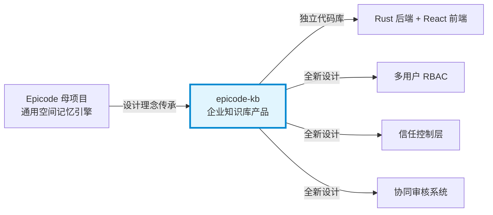
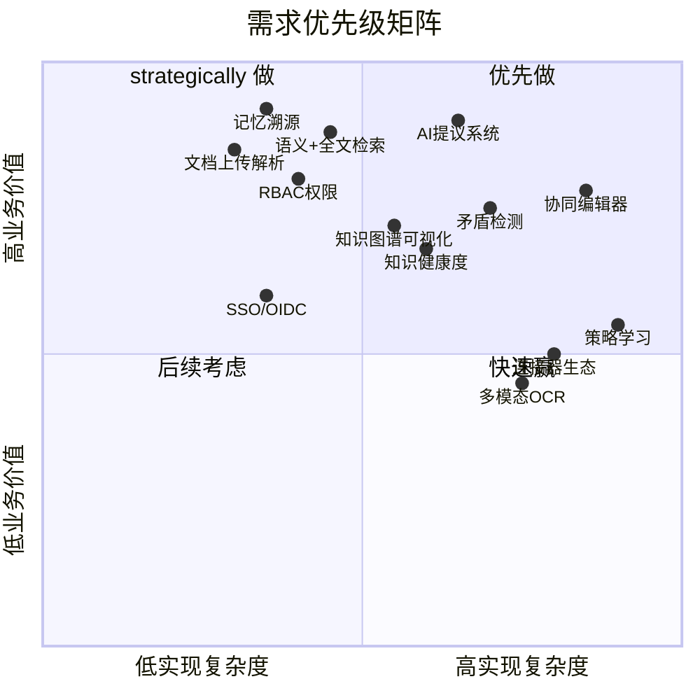
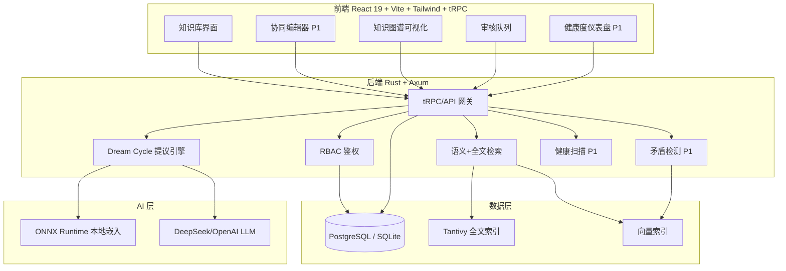
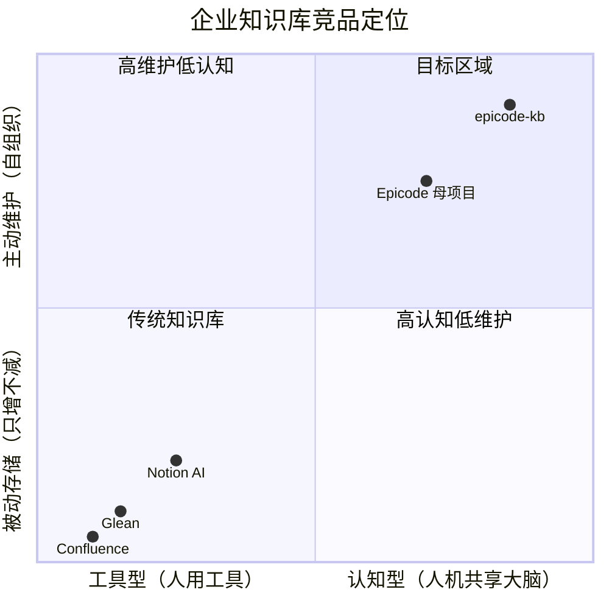

# epicode-kb 产品需求文档 (PRD)

> **文档版本**：v1.0
> **日期**：2026-06-25
> **作者**：许清楚（产品经理）
> **状态**：待评审

---

## 1. 产品定义

### 1.1 基本信息

| 字段 | 值 |
|------|------|
| 产品名称 | epicode-kb |
| 一句话定位 | 人机协同认知企业知识库 |
| 编程语言 | Rust (后端) + TypeScript/React (前端) |
| 项目名 (snake_case) | epicode_kb |
| 仓库路径 | `epicode-kb`（独立仓库） |

### 1.2 原始需求复述

基于 Epicode 母项目的空间记忆理念，构建一个独立的"人机协同认知企业知识库系统"。系统不是"人问 AI 答"的传统检索增强（L1）或辅助写作（L2），而是达到 **L3 协同认知**——人和 AI 共享记忆空间、协同思考。核心特征包括：记忆溯源（provenance 标记 + 信任分级）、四种协同模式、三层信任控制、AI 提议审核系统。本仓库为全新设计，不 fork Epicode 代码，仅共享设计理念。

### 1.3 产品愿景

**让企业知识库从"被动存储"进化为"人机共享的认知大脑"。**

传统知识库的根本问题是知识只增不减、越来越乱、无人整理。epicode-kb 利用空间记忆内核构建人机共享的认知空间——AI 充当永不疲倦的知识管家（主动整理、矛盾检测、健康监控），人类做最终决策（审核、采纳、拒绝）。每个认知体（人/AI）的写入都携带来源标记与信任等级，形成可追溯、可控制、可持续自我维护的知识生态系统。

### 1.4 与 Epicode 的关系

| 维度 | 说明 |
|------|------|
| 关系定位 | **独立项目**，非 fork、非插件 |
| 共享内容 | 设计理念（空间记忆、dream cycle、energy 模型、知识图谱）|
| 不共享内容 | 代码库完全独立，epicode-kb 从零构建 |
| 母项目参考 | `/Users/sunorme/sunormesky-max_epicode/docs/design/human-ai-collaborative-kb.md` |
| 差异化 | epicode-kb 专注企业知识库场景（多用户、RBAC、信任控制、协同审核），Epicode 是通用空间记忆引擎 |



---

## 2. 目标用户

### 2.1 用户画像

| 用户角色 | 典型场景 | 核心痛点 | 期望价值 |
|---------|---------|---------|---------|
| **企业知识工作者** | 日常撰写文档、查找方案、复用经验 | 知识散落各处、重复劳动、找不到前人结论 | AI 主动召回相关知识，避免重复造轮子 |
| **团队管理者** | 审核知识质量、推动知识沉淀 | 知识库越来越乱、没人整理、过时信息误导 | AI 自动整理+人工审核，知识库自维护 |
| **IT/运维团队** | 部署维护、权限管控、合规审计 | 数据安全顾虑、AI 行为不可控 | 三层信任控制、完整审计日志、私有化部署 |
| **AI Agent 开发者** | 基于知识库构建 agent 应用 | AI 无记忆、无法积累组织知识 | 共享记忆空间 API，agent 可读写带溯源的记忆 |

### 2.2 用户规模假设（MVP 阶段）

- 单实例支持 **50-200 并发用户**
- 知识库规模 **10 万-100 万条记忆**
- 团队/空间数 **10-100 个**

---

## 3. 核心用户故事

以下用户故事覆盖四种协同模式，格式为 "As a [role], I want [feature] so that [benefit]"。

### 模式一：AI 辅助写作（人主导）

**US-1**：作为一名**企业知识工作者**，我希望在撰写技术方案时，AI 能实时召回我团队已有的相关知识并展示在侧边栏，这样我能避免重复造轮子并保持与既有结论一致。

**US-2**：作为一名**企业知识工作者**，我希望在编辑文档时，AI 能检测我写的内容与知识库中已有结论是否矛盾并发出警告，这样我不会发布自相矛盾的信息。

### 模式二：AI 主动整理（AI 主导，人审核）

**US-3**：作为一名**团队管理者**，我希望 AI 能定期扫描知识库，发现重复内容后生成"合并提议"并提交到审核队列，这样我只需花几分钟审批就能保持知识库整洁，而不必手动逐条检查。

**US-4**：作为一名**团队管理者**，我希望 AI 能发现主题聚类后自动生成主题摘要提议，并标注这是 AI 生成的（provenance=AI），这样我的团队能快速获得某主题的结构化概览，同时清楚地知道这是 AI 草稿需要审核。

### 模式三：协同问答（人提问，AI + 人协同答）

**US-5**：作为一名**企业知识工作者**，我希望提问时 AI 的回答能标注每句话的来源记忆 ID 和信任等级，这样我能判断哪些是已验证的高信任知识、哪些是 AI 推测需要进一步确认。

**US-6**：作为一名**企业知识工作者**，我希望在 AI 回答后能补充修正，且我的修正会写入为协同记忆（provenance=Co）并提升该答案的信任等级，这样下次同事问同样问题时能直接获得已验证的答案。

### 模式四：AI 主动预警（AI 主动，人决策）

**US-7**：作为一名**团队管理者**，我希望 AI 能定期生成"知识库健康报告"，包括过时知识、知识缺口和知识孤岛的清单，这样我能主动维护知识库质量而非等问题暴露才发现。

**US-8**：作为一名**IT/运维团队成员**，我希望能在组织策略层配置哪些空间允许 AI 写入、AI 记忆的默认信任等级和数据保留策略，这样我能满足企业合规要求并控制 AI 的行为边界。

**US-9**（补充）：作为一名**AI Agent 开发者**，我希望通过 API 读写带有 provenance 标记的记忆，这样我开发的 agent 能复用组织积累的已验证知识而非每次从零开始。

---

## 4. 需求池

### 4.1 P0 — MVP 必须有

| ID | 需求 | 描述 | 验收标准 |
|----|------|------|---------|
| P0-1 | **记忆溯源** | 每条记忆携带 `provenance`（human/ai/co/conflict）、`trust_level`（0.0-1.0）、`review_status`（pending/accepted/rejected/expired） | 记忆写入必须带 provenance；前端卡片显示来源标签+信任指示器+审核状态 |
| P0-2 | **基础文档上传与解析** | 支持 Markdown、纯文本、PDF 上传，解析后写入记忆空间 | 上传后自动分块、生成 embedding、写入记忆，provenance=human |
| P0-3 | **语义检索 + 全文检索** | 同时支持向量语义检索和 Tantivy 全文检索，结果按信任等级加权排序 | 检索结果支持 provenance 过滤（`min_trust`、`provenance` 参数）；混合排序 |
| P0-4 | **RBAC 权限模型** | 基于角色的访问控制：Admin / Space Owner / Editor / Viewer | 用户只能访问有权限的空间；空间级权限隔离；角色可分配 |
| P0-5 | **AI 提议系统** | Dream cycle 升级版：AI 生成 Proposal（merge/link/summarize/conflict/archive）而非直接修改记忆，进入审核队列 | 提议状态机 pending→approved/rejected/modified；审核结果反馈记录；支持批量操作 |
| P0-6 | **知识图谱可视化** | 展示记忆间关系，节点按 provenance 着色（human 蓝/AI 紫/co 绿/conflict 红），支持矛盾边 | 图谱可交互（缩放/拖拽/点击查看详情）；按空间过滤 |

### 4.2 P1 — 重要但可后续

| ID | 需求 | 描述 |
|----|------|------|
| P1-1 | **协同编辑器（WebSocket）** | 富文本编辑器 + AI 侧边栏，实时召回相关记忆、实时矛盾检测，增量写入为 Co 记忆 |
| P1-2 | **矛盾检测与冲突解决** | 语义距离 + 关键事实对比检测矛盾，创建 Conflict 记忆，冲突中心 UI 并排展示+解决操作 |
| P1-3 | **知识健康度监控** | 衰减模型 + 知识缺口检测（0 结果查询日志）+ 孤岛检测，健康度仪表盘，通知系统 |
| P1-4 | **SSO/OIDC** | 企业单点登录集成（OIDC 协议），支持 Okta/Keycloak/Azure AD |

### 4.3 P2 — 锦上添花

| ID | 需求 | 描述 |
|----|------|------|
| P2-1 | **连接器生态** | Slack/飞书/Confluence/Notion 数据源连接器，定时同步 |
| P2-2 | **多模态（OCR）** | 图片/PDF 中的文字 OCR 识别，图表内容描述 |
| P2-3 | **策略学习** | 记录人的审核偏好，AI 自动调整提议的激进程度和类型偏好 |

### 4.4 需求优先级矩阵



---

## 5. 技术栈建议

### 5.1 技术选型

| 层 | 技术 | 选型理由 |
|----|------|---------|
| **后端语言** | Rust | 性能 + 安全 + 与 Epicode 设计理念一致 |
| **Web 框架** | Axum | 异步生态成熟，Tower 中间件生态丰富 |
| **数据库（开发）** | SQLite | 零配置，快速启动 |
| **数据库（生产）** | PostgreSQL | 企业级可靠性，JSONB 支持 provenance_meta，并发性能 |
| **全文检索** | Tantivy | Rust 原生全文搜索引擎，高性能 |
| **前端框架** | React 19 + Vite | 生态最大，并发渲染特性 |
| **UI 库** | Tailwind CSS | 原子化 CSS，快速迭代 |
| **API 层** | tRPC | 端到端类型安全，前后端共享类型 |
| **AI 嵌入** | ONNX Runtime | 本地推理，无需外部 API，隐私友好 |
| **LLM** | DeepSeek / OpenAI | 可配置切换，DeepSeek 性价比高 |
| **协同** | WebSocket + Yjs (CRDT) | 实时协同编辑，冲突自动合并 |
| **向量存储** | 内置（SQLite/PG + 向量扩展） | MVP 阶段不引入独立向量数据库 |

### 5.2 架构总览



### 5.3 关键数据模型

```sql
-- 记忆表（核心）
CREATE TABLE memories (
    id TEXT PRIMARY KEY,
    space_id TEXT NOT NULL,
    content TEXT NOT NULL,
    embedding BLOB,                  -- 向量
    provenance TEXT DEFAULT 'human', -- human|ai|co|conflict
    provenance_meta TEXT,            -- JSON
    trust_level REAL DEFAULT 1.0,    -- 0.0~1.0
    review_status TEXT DEFAULT 'accepted', -- pending|accepted|rejected|expired
    parent_conflict_id TEXT,
    last_accessed_at INTEGER,
    created_at INTEGER NOT NULL,
    updated_at INTEGER NOT NULL
);

-- AI 提议表
CREATE TABLE ai_proposals (
    id TEXT PRIMARY KEY,
    space_id TEXT NOT NULL,
    proposal_type TEXT NOT NULL,     -- merge|link|summarize|conflict|archive
    source_memory_ids TEXT NOT NULL, -- JSON array
    proposed_content TEXT,
    proposed_action TEXT,
    ai_model TEXT,
    confidence REAL,
    status TEXT DEFAULT 'pending',   -- pending|approved|rejected|modified
    reviewer_id TEXT,
    reviewed_at INTEGER,
    review_feedback TEXT,
    created_at INTEGER NOT NULL
);

-- 查询日志（知识缺口检测）
CREATE TABLE query_logs (
    id TEXT PRIMARY KEY,
    space_id TEXT NOT NULL,
    user_id TEXT,
    query TEXT NOT NULL,
    result_count INTEGER NOT NULL,
    query_type TEXT NOT NULL,        -- search|recall|ask
    created_at INTEGER NOT NULL
);

-- 知识健康度快照
CREATE TABLE knowledge_health (
    id TEXT PRIMARY KEY,
    space_id TEXT NOT NULL,
    snapshot_date TEXT NOT NULL,
    total_memories INTEGER,
    human_ratio REAL,
    ai_ratio REAL,
    co_ratio REAL,
    conflict_count INTEGER,
    avg_trust REAL,
    stale_count INTEGER,
    orphan_count INTEGER,
    gap_count INTEGER,
    health_score REAL,
    created_at INTEGER NOT NULL
);
```

### 5.4 API 设计概要

```
# 记忆与检索
POST /api/v1/remember          # 写入记忆（支持 provenance）
GET  /api/v1/search            # 检索（支持 min_trust、provenance 过滤）
POST /api/v1/recall            # 上下文召回

# AI 提议
GET  /api/v1/proposals         # 列出待审核提议
POST /api/v1/proposals/{id}/approve
POST /api/v1/proposals/{id}/reject
POST /api/v1/proposals/{id}/modify

# 信任管理
POST /api/v1/memories/{id}/trust   # 调整信任等级
POST /api/v1/memories/{id}/adopt   # 采纳 AI 记忆
POST /api/v1/memories/{id}/reject  # 拒绝 AI 记忆

# 协同写作 (P1)
POST /api/v1/collab/context    # 获取编辑上下文相关记忆
POST /api/v1/collab/check      # 检查内容矛盾
WS   /api/v1/collab/stream     # 实时协同通道

# 知识健康 (P1)
GET  /api/v1/health/space/{id} # 空间健康度
GET  /api/v1/health/gaps       # 知识缺口
POST /api/v1/health/scan       # 手动触发扫描

# 冲突 (P1)
GET  /api/v1/conflicts         # 列出未解决冲突
POST /api/v1/conflicts/{id}/resolve
```

---

## 6. 首个 Sprint 范围

### 6.1 Sprint 1 目标

**交付一个可运行的知识库骨架，验证"记忆溯源 + 检索"核心链路。**

从 P0 中选取 3 项作为首个可交付 Sprint：

| Sprint 1 项 | 理由 |
|-------------|------|
| **P0-1 记忆溯源** | 整个系统的信任基础，所有后续功能依赖 provenance |
| **P0-2 文档上传与解析** | 最基础的数据入口，验证"写入记忆"完整链路 |
| **P0-3 语义+全文检索** | 核心使用场景，验证"读取记忆"完整链路 |

### 6.2 Sprint 1 交付物

```
epicode-kb/
├── backend/              # Rust + Axum 后端
│   ├── src/
│   │   ├── main.rs
│   │   ├── api/          # API 路由
│   │   ├── db/           # 数据库层（SQLite）
│   │   ├── memory/       # 记忆模型（含 provenance）
│   │   ├── search/       # 检索引擎（Tantivy + 向量）
│   │   └── embed/        # ONNX 嵌入
│   └── Cargo.toml
├── frontend/             # React 19 + Vite 前端
│   ├── src/
│   │   ├── App.tsx
│   │   ├── components/   # 记忆卡片（来源标签+信任指示器）
│   │   ├── pages/        # 上传页、检索页
│   │   └── trpc/         # tRPC 客户端
│   └── package.json
├── docs/prd/v1.md        # 本文档
└── README.md
```

### 6.3 Sprint 1 验收标准

- [ ] 可上传 Markdown/TXT 文件，系统解析分块并写入记忆（provenance=human）
- [ ] 每条记忆在数据库中有 provenance、trust_level、review_status 字段
- [ ] 前端记忆卡片显示来源标签（🟢人类）和信任指示器
- [ ] 语义检索和全文检索均可用，结果按信任等级加权排序
- [ ] 检索支持 `min_trust` 和 `provenance` 过滤参数
- [ ] SQLite 开发数据库可零配置启动

### 6.4 后续 Sprint 规划

| Sprint | 范围 | 预计周期 |
|--------|------|---------|
| Sprint 2 | P0-4 RBAC + P0-6 知识图谱可视化 | 2 周 |
| Sprint 3 | P0-5 AI 提议系统（dream cycle + 审核队列） | 3 周 |
| Sprint 4 | P1-1 协同编辑器 + P1-2 矛盾检测 | 4 周 |
| Sprint 5 | P1-3 知识健康度 + P1-4 SSO | 3 周 |

---

## 7. 待确认问题

| # | 问题 | 影响范围 | 建议方向 |
|---|------|---------|---------|
| Q1 | 生产环境向量检索方案：PG 向量扩展（pgvector）是否够用，还是需要独立向量数据库（Qdrant/Milvus）？ | 架构设计 | MVP 用 pgvector，10 万级记忆够用；百万级再评估 |
| Q2 | LLM 调用是本地部署（Ollama）还是仅支持云端 API（DeepSeek/OpenAI）？企业私有化部署需求强 | 部署方案 | 抽象 LLM Provider 接口，两者都支持，配置切换 |
| Q3 | 多租户隔离方案：单库多 schema 还是每租户独立库？ | 数据架构 | MVP 单实例单库 + 空间级逻辑隔离；多租户为后续企业版 |
| Q4 | 协同编辑器（P1-1）是否在 MVP 就需要？部分企业用户可能认为实时协同是刚需 | Sprint 规划 | MVP 先做非实时编辑+AI 异步建议，P1 再加 WebSocket 实时 |
| Q5 | 知识图谱可视化的前端库选择：D3.js（灵活但复杂）还是 Cytoscape.js（图谱专用）？ | 前端技术 | 倾向 Cytoscape.js，图谱交互开箱即用 |
| Q6 | AI 提议的审核通知渠道：仅站内通知，还是需要邮件/IM（Slack/飞书）推送？ | 用户体验 | MVP 站内通知 + Webhook；IM 集成归入 P2 连接器 |
| Q7 | 文档解析的 PDF 支持：用 Rust � crates（如 pdf-extract）还是外部服务？解析质量差异大 | 解析能力 | MVP 先支持 Markdown/TXT；PDF 用 Rust crate 基础解析，复杂排版后续优化 |
| Q8 | 企业部署形态：Docker Compose 够用，还是需要 Kubernetes Helm Chart？ | 部署运维 | MVP 提供 Docker Compose；K8s 作为企业版特性 |

---

## 8. 竞品定位

### 8.1 竞品对比表

| 能力维度 | Notion AI | Glean | Confluence | Epicode (母项目) | **epicode-kb** |
|---------|-----------|-------|-----------|-----------------|----------------|
| **认知层次** | L2 辅助写作 | L1 检索增强 | L1 检索增强 | L3 协同认知(引擎) | **L3 协同认知(产品)** |
| AI 有自己的记忆 | 无 | 无 | 无 | 有（空间记忆） | **有（共享记忆空间）** |
| AI 主动整理知识 | 无 | 无 | 无 | 有（dream cycle） | **有（提议+审核）** |
| 人可审核 AI 修改 | N/A | N/A | N/A | 无（静默整理） | **有（Proposal 系统）** |
| 知识矛盾检测 | 无 | 无 | 无 | 无 | **有（Conflict 检测）** |
| 知识健康度监控 | 无 | 无 | 无 | 基础统计 | **有（衰减+缺口+孤岛）** |
| AI 记忆可追溯 | N/A | N/A | N/A | 无 | **有（provenance+trust）** |
| 知识图谱可视化 | 无 | 无 | 基础 | 有（空间+图谱） | **有（+矛盾边+来源着色）** |
| 企业 RBAC | 有 | 有 | 有 | 无（单用户） | **有（多用户 RBAC）** |
| 三层信任控制 | 无 | 无 | 无 | 无 | **有（组织/空间/个人）** |
| 私有化部署 | 无（SaaS） | 无（SaaS） | 有（DC版） | 有（本地） | **有（Docker/K8s）** |
| 定位 | AI 写作助手 | 企业搜索 | 文档协作 | 记忆引擎 | **人机共享认知大脑** |

### 8.2 差异化定位象限



### 8.3 核心叙事

> **epicode-kb 不是"带 AI 的知识库"，而是"人和 AI 共享大脑的知识系统"。**

- vs Notion AI：Notion AI 是写作助手（L2），无记忆、无主动整理、无信任控制。epicode-kb 是认知伙伴（L3），AI 有记忆、主动整理、可审核可追溯。
- vs Glean：Glean 是企业搜索（L1），AI 只读不写。epicode-kb 的 AI 可写入共享记忆空间，且每条 AI 记忆都有来源标记和信任分级。
- vs Confluence：Confluence 是文档协作工具，知识只增不减。epicode-kb 的 dream cycle + 健康度监控让知识库自维护。
- vs Epicode 母项目：Epicode 是通用记忆引擎（单用户）。epicode-kb 是面向企业的产品（多用户 RBAC + 信任控制 + 协同审核）。

---

## 9. 风险与缓解

| 风险 | 影响 | 缓解策略 |
|------|------|---------|
| AI 记忆质量低导致信任崩塌 | 用户关闭所有 AI 功能 | 信任分级 + 默认折叠 + 人工审核门控 |
| 审核队列积压淹没用户 | 用户忽略审核，提议失效 | 冲突优先级排序 + 批量操作 + 超时自动降级 |
| 策略学习冷启动困难 | AI 提议不准，用户体验差 | 预置合理默认策略 + 逐步学习 + 用户反馈闭环 |
| 实时协同延迟影响写作体验 | 用户放弃协同编辑 | 增量检索 + 本地缓存 + 后台异步同步 |
| 企业隐私顾虑（AI 读取所有知识） | 企业不敢采用 | 空间级 AI 开关 + 加密 + 完整审计日志 + 私有化部署 |
| Rust 生态某些库不够成熟 | 开发效率受影响 | 核心依赖（Axum/Tantivy/SQLx）已验证成熟；不成熟的部分用 FFI 或纯实现 |

---

## 10. 成功指标（MVP 阶段）

| 指标 | 目标值 | 衡量方式 |
|------|--------|---------|
| 记忆写入延迟（含 embedding） | < 500ms | API 响应时间 P95 |
| 语义检索延迟 | < 200ms | API 响应时间 P95 |
| 全文检索延迟 | < 100ms | API 响应时间 P95 |
| AI 提议采纳率 | > 40% | approved / (approved + rejected) |
| 审核队列平均处理时间 | < 24h | reviewed_at - created_at 均值 |
| 知识库去重率（dream cycle 合并提议执行后） | > 20% | 合并记忆数 / 总记忆数 |

---

> **本文档为 epicode-kb v1 PRD，待团队评审后进入架构设计阶段。**
